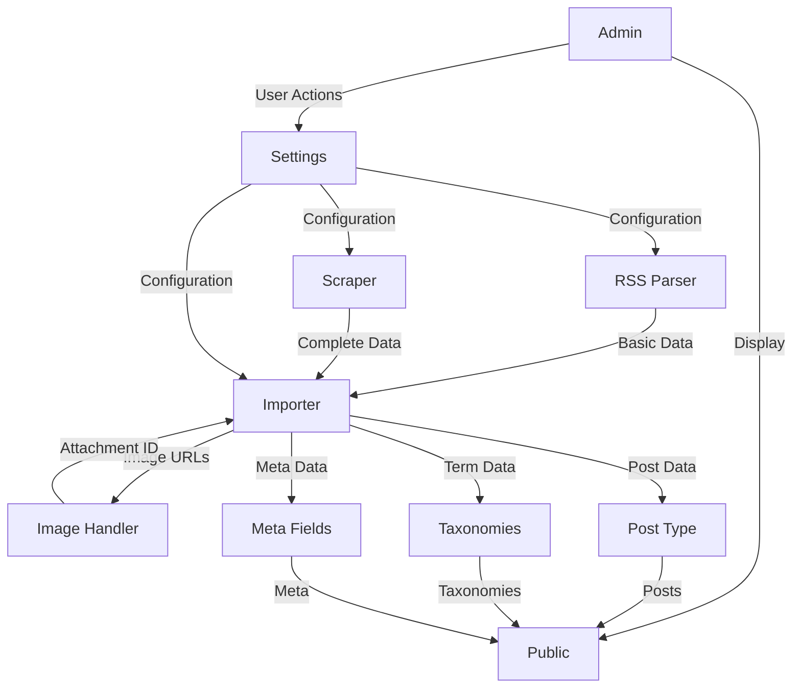

# Architecture Components

## Component Overview

Beer Journal is built with a modular architecture. Each component has a specific responsibility and interacts with other components through well-defined interfaces.

## Core Components

### 1. RSS Parser (`BJ_RSS_Parser`)

**Location**: `includes/class-rss-parser.php`

**Responsibility**: Fetches and parses Untappd RSS feed

**Key Features**:
- Fetches RSS feed from Untappd
- Parses XML using WordPress SimplePie
- Extracts basic check-in data (title, link, GUID, date)
- Implements adaptive polling logic
- Compares GUIDs to detect new check-ins

**Dependencies**:
- WordPress SimplePie (built-in)
- WordPress HTTP API

**Output**: Array of check-in items with basic data

**Related**: [RSS Sync Documentation](rss-sync.md)

---

### 2. HTML Scraper (`BJ_Scraper`)

**Location**: `includes/class-scraper.php`

**Responsibility**: Scrapes individual Untappd check-in pages for complete metadata

**Key Features**:
- Fetches HTML pages from Untappd
- Parses HTML using Symfony DomCrawler
- Extracts complete metadata (rating, ABV, style, comment, etc.)
- Implements rate limiting
- Handles errors and retries

**Dependencies**:
- Symfony DomCrawler
- Symfony CSS Selector
- Guzzle HTTP Client

**Output**: Complete check-in data array

**Related**: [Scraping Documentation](scraping.md)

---

### 3. Data Importer (`BJ_Importer`)

**Location**: `includes/class-importer.php`

**Responsibility**: Processes and imports check-in data into WordPress

**Key Features**:
- Validates data completeness
- Creates Custom Post Type entries
- Assigns taxonomies (beer styles, breweries, venues)
- Manages post status (publish/draft)
- Handles deduplication
- Implements retry logic

**Dependencies**:
- WordPress Post API
- WordPress Taxonomy API
- WordPress Meta API

**Output**: WordPress post ID or WP_Error

**Related**: [Import Process Documentation](import-process.md)

---

### 4. Image Handler (`BJ_Image_Handler`)

**Location**: `includes/class-image-handler.php`

**Responsibility**: Downloads and imports images to WordPress Media Library

**Key Features**:
- Downloads images from URLs
- Checks for duplicates (MD5 hash)
- Imports to Media Library
- Generates thumbnails
- Sets alt text and captions
- Handles errors and placeholders

**Dependencies**:
- WordPress Media API
- WordPress HTTP API

**Output**: Attachment ID or false

**Related**: [Image Handling Documentation](image-handling.md)

---

### 5. Rating System

**Location**: `includes/class-settings.php` (configuration) + template tags

**Responsibility**: Manages rating display and mapping

**Key Features**:
- Stores raw ratings (0-5 with decimals)
- Maps to rounded star ratings (0-5 stars)
- Customizable mapping rules
- Customizable labels per rating level
- Template tags for display

**Dependencies**:
- WordPress Options API
- WordPress Meta API

**Output**: HTML for rating display

**Related**: [Rating System Documentation](rating-system.md)

---

### 6. Custom Post Type (`BJ_Post_Type`)

**Location**: `includes/class-post-type.php`

**Responsibility**: Registers and manages the `beer` Custom Post Type

**Key Features**:
- Registers CPT with WordPress
- Configures REST API support
- Sets up rewrite rules
- Manages capabilities

**Dependencies**:
- WordPress Post Type API

**Related**: [Database Schema Documentation](../db/schema.md)

---

### 7. Taxonomies (`BJ_Taxonomies`)

**Location**: `includes/class-taxonomies.php`

**Responsibility**: Registers and manages taxonomies

**Key Features**:
- Registers `beer_style` (hierarchical)
- Registers `brewery` (non-hierarchical)
- Registers `venue` (non-hierarchical)
- Auto-creates terms on import
- Notifies admin of new terms

**Dependencies**:
- WordPress Taxonomy API

**Related**: [Database Schema Documentation](../db/schema.md)

---

### 8. Meta Fields (`BJ_Meta_Fields`)

**Location**: `includes/class-meta-fields.php`

**Responsibility**: Registers and manages custom meta fields

**Key Features**:
- Defines meta field structure
- Registers meta fields with REST API
- Provides sanitization callbacks
- Manages meta field display in admin

**Dependencies**:
- WordPress Meta API
- WordPress REST API

**Related**: [Meta Fields Documentation](../db/meta-fields.md)

---

### 9. Admin Interface (`BJ_Admin`)

**Location**: `admin/class-admin.php`

**Responsibility**: Manages admin interface and settings

**Key Features**:
- Settings pages (5 tabs)
- Import progress tracking (AJAX)
- Logs viewer
- Statistics dashboard
- Admin notices

**Dependencies**:
- WordPress Settings API
- WordPress Admin API

**Related**: [WordPress Integration Documentation](../wordpress/hooks.md)

---

### 10. Frontend Templates (`BJ_Public`)

**Location**: `public/class-public.php`

**Responsibility**: Manages frontend display and templates

**Key Features**:
- Enqueues frontend assets
- Registers template hierarchy
- Provides template tags
- Manages hooks and filters

**Dependencies**:
- WordPress Template API
- WordPress Enqueue API

**Related**: [Frontend Documentation](../frontend/templates.md)

---

### 11. Settings Manager (`BJ_Settings`)

**Location**: `includes/class-settings.php`

**Responsibility**: Manages plugin settings and options

**Key Features**:
- Settings registration
- Settings validation
- Settings sanitization
- Default values management

**Dependencies**:
- WordPress Settings API
- WordPress Options API

**Related**: [WordPress Integration Documentation](../wordpress/hooks.md)

---

### 12. Action Scheduler (`BJ_Action_Scheduler`)

**Location**: `includes/class-action-scheduler.php`

**Responsibility**: Manages scheduled tasks and cron jobs

**Key Features**:
- RSS sync scheduling (adaptive)
- Background import batches
- Retry scheduling
- Checkpoint management

**Dependencies**:
- WordPress Cron API

**Related**: [RSS Sync Documentation](rss-sync.md)

---

## Component Interactions

## Data Flow Between Components

1. **RSS Parser** fetches feed → extracts basic data
2. **Importer** receives basic data → requests scraping
3. **Scraper** fetches HTML → extracts complete data
4. **Importer** receives complete data → validates
5. **Image Handler** downloads images → returns attachment IDs
6. **Importer** creates post → assigns taxonomies → sets meta fields
7. **Public** displays posts → uses template tags → applies filters

## Extension Points

Each component provides hooks for extension:

- **RSS Parser**: `bj_rss_item_parsed` (filter)
- **Scraper**: `bj_scraped_data` (filter)
- **Importer**: `bj_before_import`, `bj_after_import` (actions)
- **Image Handler**: `bj_image_downloaded` (action)
- **Rating System**: `bj_rating_display` (filter)
- **Templates**: Multiple hooks and filters

## Related Documentation

- [Architecture Overview](overview.md)
- [Data Flow](data-flow.md)
- [RSS Sync](rss-sync.md)
- [Scraping](scraping.md)
- [Import Process](import-process.md)
- [Rating System](rating-system.md)
- [Image Handling](image-handling.md)

