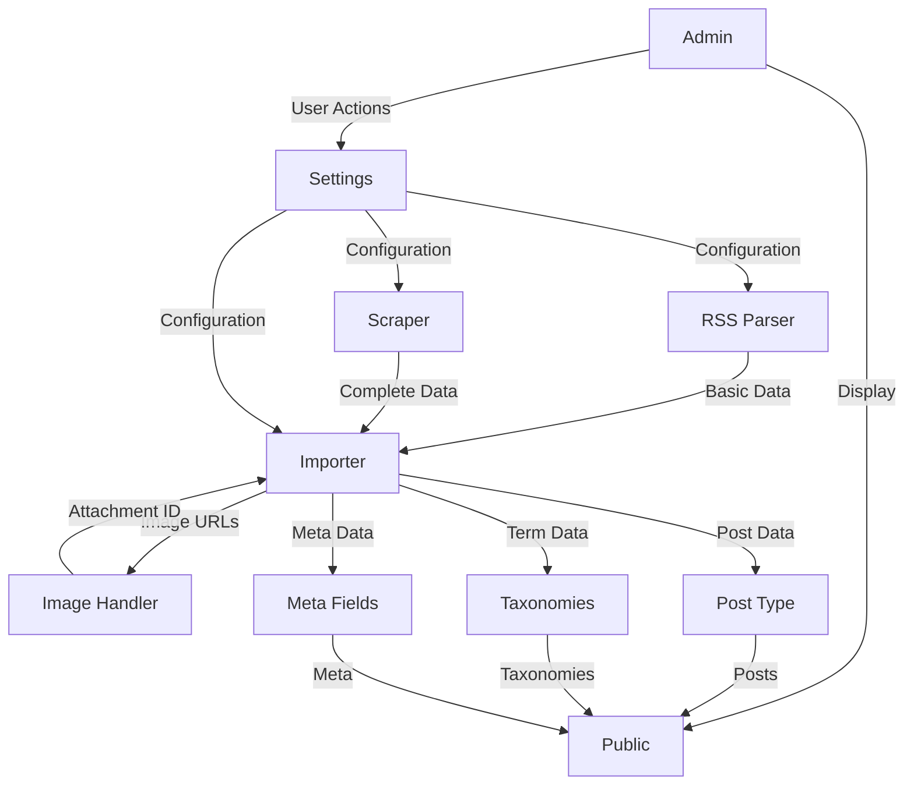

# Architecture Components

## Component Overview

Jardin Toasts is built with a modular architecture. Each component has a specific responsibility and interacts with other components through well-defined interfaces.

## Core Components

### 1. RSS Parser (`JB_RSS_Parser`)

**Location**: `includes/class-rss-parser.php`

**Responsibility**: Fetches and parses Untappd RSS feed

**Key Features**:
- Fetches RSS feed from Untappd
- Parses XML using WordPress SimplePie
- Extracts basic check-in data (title, link, GUID, date)
- Implements adaptive polling logic
- Compares GUIDs to detect new check-ins

**Dependencies**:
- WordPress SimplePie (built-in)
- WordPress HTTP API

**Output**: Array of check-in items with basic data

**Related**: [RSS Sync Documentation](rss-sync.md)

---

### 2. HTML Scraper (`JB_Scraper`)

**Location**: `includes/class-scraper.php`

**Responsibility**: Scrapes individual Untappd check-in pages for complete metadata

**Key Features**:
- Fetches HTML pages from Untappd
- Parses HTML using Symfony DomCrawler
- Extracts complete metadata (rating, ABV, style, comment, etc.)
- Implements rate limiting
- Handles errors and retries

**Dependencies**:
- Symfony DomCrawler
- Symfony CSS Selector
- Guzzle HTTP Client

**Output**: Complete check-in data array

**Related**: [Scraping Documentation](scraping.md)

---

### 3. Data Importer (`JB_Importer`)

**Location**: `includes/class-importer.php`

**Responsibility**: Processes and imports check-in data into WordPress

**Key Features**:
- Validates data completeness
- Creates Custom Post Type entries
- Assigns taxonomies (beer styles, breweries, venues)
- Manages post status (publish/draft)
- Handles deduplication
- Implements retry logic

**Dependencies**:
- WordPress Post API
- WordPress Taxonomy API
- WordPress Meta API

**Output**: WordPress post ID or WP_Error

**Related**: [Import Process Documentation](import-process.md)

---

### 4. Image Handler (`JB_Image_Handler`)

**Location**: `includes/class-image-handler.php`

**Responsibility**: Downloads and imports images to WordPress Media Library

**Key Features**:
- Downloads images from URLs
- Checks for duplicates (MD5 hash)
- Imports to Media Library
- Generates thumbnails
- Sets alt text and captions
- Handles errors and placeholders

**Dependencies**:
- WordPress Media API
- WordPress HTTP API

**Output**: Attachment ID or false

**Related**: [Image Handling Documentation](image-handling.md)

---

### 5. Rating System

**Location**: `includes/class-settings.php` (configuration) + template tags

**Responsibility**: Manages rating display and mapping

**Key Features**:
- Stores raw ratings (0-5 with decimals)
- Maps to rounded star ratings (0-5 stars)
- Customizable mapping rules
- Customizable labels per rating level
- Template tags for display

**Dependencies**:
- WordPress Options API
- WordPress Meta API

**Output**: HTML for rating display

**Related**: [Rating System Documentation](rating-system.md)

---

### 6. Custom Post Type (`JB_Post_Type`)

**Location**: `includes/class-post-type.php`

**Responsibility**: Registers and manages the `beer` Custom Post Type

**Key Features**:
- Registers CPT with WordPress
- Configures REST API support
- Sets up rewrite rules
- Manages capabilities

**Dependencies**:
- WordPress Post Type API

**Related**: [Database Schema Documentation](../db/schema.md)

---

### 7. Taxonomies (`JB_Taxonomies`)

**Location**: `includes/class-taxonomies.php`

**Responsibility**: Registers and manages taxonomies

**Key Features**:
- Registers `beer_style` (hierarchical)
- Registers `brewery` (non-hierarchical)
- Registers `venue` (non-hierarchical)
- Auto-creates terms on import
- Notifies admin of new terms

**Dependencies**:
- WordPress Taxonomy API

**Related**: [Database Schema Documentation](../db/schema.md)

---

### 8. Meta Fields (`JB_Meta_Fields`)

**Location**: `includes/class-meta-fields.php`

**Responsibility**: Registers and manages custom meta fields

**Key Features**:
- Defines meta field structure
- Registers meta fields with REST API
- Provides sanitization callbacks
- Manages meta field display in admin

**Dependencies**:
- WordPress Meta API
- WordPress REST API

**Related**: [Meta Fields Documentation](../db/meta-fields.md)

---

### 9. Admin Interface (`JB_Admin`)

**Location**: `admin/class-admin.php`

**Responsibility**: Manages admin interface and settings

**Key Features**:
- Settings pages with WordPress native tab navigation (5 tabs)
- Inline help texts under each settings section
- Import progress tracking (AJAX)
- Logs viewer
- Statistics dashboard
- Admin notices

**Tab Structure**:
1. **Synchronization** - RSS sync, adaptive polling
2. **Historical Import** - Manual import, crawler
3. **Rating System** - Mapping rules, labels
4. **Taxonomies** - Review/merge terms
5. **Advanced** - Cache, Schema.org, logs, debug

**Inline Help**:
- Contextual help texts using WordPress `.description` class
- Positioned directly under settings sections
- All text translatable
- Optional `dashicons-editor-help` icon for emphasis

**Dependencies**:
- WordPress Settings API
- WordPress Admin API
- WordPress native tab navigation classes

**Related**: [WordPress Integration Documentation](../wordpress/hooks.md), [Admin Navigation](../user-flows/navigation.md#admin-interface-navigation)

---

### 10. Frontend Templates (`JB_Public`)

**Location**: `public/class-public.php`

**Responsibility**: Manages frontend display and templates

**Key Features**:
- Enqueues frontend assets
- Registers template hierarchy
- Provides template tags
- Manages hooks and filters

**Dependencies**:
- WordPress Template API
- WordPress Enqueue API

**Related**: [Frontend Documentation](../frontend/templates.md)

---

### 11. Settings Manager (`JB_Settings`)

**Location**: `includes/class-settings.php`

**Responsibility**: Manages plugin settings and options

**Key Features**:
- Settings registration
- Settings validation
- Settings sanitization
- Default values management

**Dependencies**:
- WordPress Settings API
- WordPress Options API

**Related**: [WordPress Integration Documentation](../wordpress/hooks.md)

---

### 12. Action Scheduler (`JB_Action_Scheduler`)

**Location**: `includes/class-action-scheduler.php`

**Responsibility**: Manages scheduled tasks and cron jobs

**Key Features**:
- RSS sync scheduling (adaptive)
- Background import batches
- Retry scheduling
- Checkpoint management

**Dependencies**:
- WordPress Cron API

**Related**: [RSS Sync Documentation](rss-sync.md)

---

## Component Interactions

## Data Flow Between Components

1. **RSS Parser** fetches feed → extracts basic data
2. **Importer** receives basic data → requests scraping
3. **Scraper** fetches HTML → extracts complete data
4. **Importer** receives complete data → validates
5. **Image Handler** downloads images → returns attachment IDs
6. **Importer** creates post → assigns taxonomies → sets meta fields
7. **Public** displays posts → uses template tags → applies filters

## Extension Points

Each component provides hooks for extension:

- **RSS Parser**: `jb_rss_item_parsed` (filter)
- **Scraper**: `jb_scraped_data` (filter)
- **Importer**: `jb_before_import`, `jb_after_import` (actions)
- **Image Handler**: `jb_image_downloaded` (action)
- **Rating System**: `jb_rating_display` (filter)
- **Templates**: Multiple hooks and filters

## Related Documentation

- [Architecture Overview](overview.md)
- [Data Flow](data-flow.md)
- [RSS Sync](rss-sync.md)
- [Scraping](scraping.md)
- [Import Process](import-process.md)
- [Rating System](rating-system.md)
- [Image Handling](image-handling.md)

---

## Additional Components (SEO & Performance)

### Caching (`JB_Cache` ou helper)

**Location**: `includes/helper-functions.php` (helper) ou `includes/class-cache.php`

**Responsibility**: Centraliser l’usage des Transients pour les opérations coûteuses (scraping, statistiques, requêtes).

**Conventions**:
- Clés préfixées `jb_` (ex. `jb_scrape_{checkinId}`, `jb_global_stats`, `jb_query_archive_{hash}`)
- TTL recommandés: scraping 3h, stats 1h, requêtes d’archive 30min
- Invalidation après import/sync (clear ciblé des clés pertinentes)

**Related**: [Caching Documentation](../development/caching.md)

---

### Schema Generator (`JB_Schema`)

**Location**: `includes/class-schema.php`

**Responsibility**: Générer et injecter le JSON-LD (Schema.org Review/Product) et activer les microformats (templates).

**Options (activées par défaut)**:
- `jb_schema_enabled` ('1'/'0')
- `jb_microformats_enabled` ('1'/'0')

**Related**: [Schema Documentation](../development/schema.md)

---

## Untappd Integration Components

### 13. Untappd Sync Orchestrator (`JB_Untappd_Sync`)

**Location**: `includes/class-untappd-sync.php`

**Responsibility**: Orchestrates Untappd import process, choosing between RSS and HTML/CSV methods

**Key Features**:
- Detects available import method (RSS API key vs HTML export)
- Coordinates RSS sync or historical import
- Manages exclusion list
- Provides unified interface for admin and WP-CLI

**Dependencies**:
- `JB_Untappd_RSS_Importer`
- `JB_Untappd_HTML_Parser`
- `JB_Untappd_CSV_Importer`
- `JB_Beer_Processor`

**Related**: [Untappd Integration Documentation](../features/untappd-integration.md)

---

### 14. Untappd RSS Importer (`JB_Untappd_RSS_Importer`)

**Location**: `includes/class-untappd-rss-importer.php`

**Responsibility**: Handles RSS feed import for incremental daily sync

**Key Features**:
- Fetches Untappd RSS feed with API key
- Parses title to extract beer name and brewery ("is drinking a ... by ...")
- Formats dates (pubDate → YYYY-MM-DD)
- Manages RSS cache (transient + persistent option)
- Extracts check-in ID from URL

**Dependencies**:
- WordPress SimplePie (built-in)
- WordPress HTTP API
- `JB_Beer_Processor`

**Output**: Array of minimal `BeerData` objects

**Related**: [RSS Sync Documentation](rss-sync.md), [RSS Sync Detailed](../features/rss-sync-detailed.md)

---

### 15. Untappd HTML Parser (`JB_Untappd_HTML_Parser`)

**Location**: `includes/class-untappd-html-parser.php`

**Responsibility**: Parses Untappd HTML export file for historical import

**Key Features**:
- Parses HTML export file (`[username]-beerlist.html`)
- Extracts beer data using CSS selectors (Symfony DomCrawler)
- Extracts ABV/IBU from text (regex: "6.5% ABV", "40 IBU")
- Extracts rating from CSS class (s450 → 4.50)
- Converts dates (MM/DD/YY → YYYY-MM-DD)
- Generates CSV file for batch processing

**Dependencies**:
- Symfony DomCrawler
- Symfony CSS Selector

**Output**: CSV file or array of enriched `BeerData` objects

**Related**: [Historical Import Detailed](../features/historical-import-detailed.md)

---

### 16. Untappd CSV Importer (`JB_Untappd_CSV_Importer`)

**Location**: `includes/class-untappd-csv-importer.php`

**Responsibility**: Imports check-ins from CSV file (generated by HTML parser)

**Key Features**:
- Reads CSV file line by line
- Validates required fields (checkin_id, beer_name, brewery_name, checkin_date, untappd_url)
- Validates date format (YYYY-MM-DD)
- Constructs enriched `BeerData` objects
- Delegates to `JB_Beer_Processor` for WordPress insertion

**Dependencies**:
- PHP CSV functions or library
- `JB_Beer_Processor`

**Output**: Import statistics (saved, skipped, errors)

**Related**: [Historical Import Detailed](../features/historical-import-detailed.md)

---

### 17. Beer Processor (`JB_Beer_Processor`)

**Location**: `includes/class-beer-processor.php`

**Responsibility**: Processes `BeerData` objects and creates WordPress posts with all metadata

**Key Features**:
- Validates `BeerData` structure (required fields)
- Checks for duplicates (by `checkinId` via meta `_jb_checkin_id`)
- Checks exclusion list (`jb_excluded_checkins` option)
- Maps `BeerData` to WordPress:
  - Creates CPT `beer_checkin` post
  - Sets meta fields `_jb_*`
  - Assigns taxonomies (beer_style, brewery, venue)
  - Downloads and attaches images (if enabled)
- Applies default values (equivalent to Eleventy template)
- Sets post status (draft by default, publish if complete)

**Dependencies**:
- `JB_Importer` (or shared logic)
- `JB_Image_Handler`
- WordPress Post/Taxonomy/Meta APIs

**Input**: `BeerData` object (array or class instance)

**Output**: WordPress post ID or WP_Error

**Related**: [Import Process Documentation](import-process.md), [Untappd Integration](../features/untappd-integration.md)

---

### 18. Untappd Config (`JB_Untappd_Config`)

**Location**: `includes/class-untappd-config.php`

**Responsibility**: Centralized configuration for Untappd integration

**Key Features**:
- Manages API key (from environment or option)
- Defines paths and directories
- Provides default values (equivalent to Eleventy template)
- Validates configuration

**Options**:
- `jb_untappd_rss_key`: RSS API key
- `jb_untappd_username`: Untappd username
- `jb_excluded_checkins`: Array of check-in IDs to exclude
- `jb_download_images`: Whether to download images (default: true)

**Related**: [Untappd Integration](../features/untappd-integration.md)

