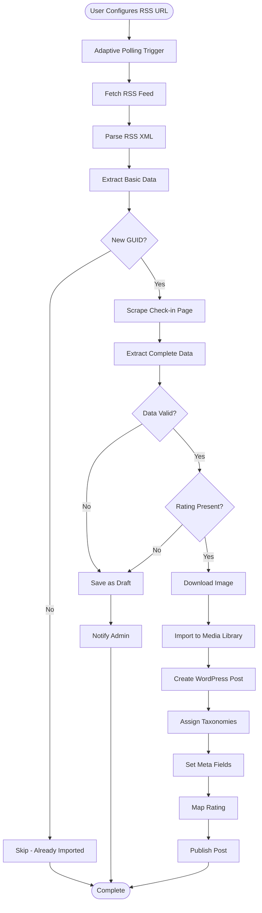
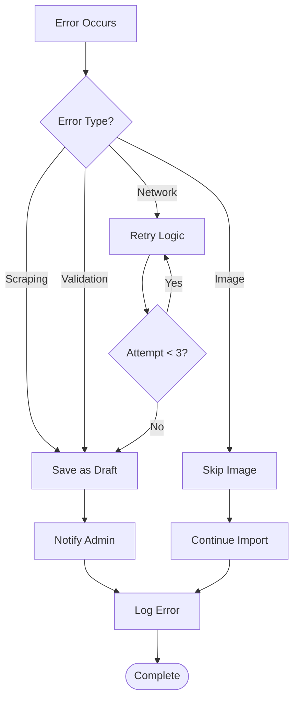

# Data Flow

## Overview

This document describes the complete data flow from Untappd to WordPress, including all steps, transformations, and decision points.

## Complete Data Flow Diagram



## Detailed Flow Steps

### Phase 1: RSS Feed Processing

#### Step 1.1: Polling Trigger
- **Component**: `BJ_Action_Scheduler`
- **Frequency**: Adaptive (6h/daily/weekly based on activity)
- **Action**: WordPress cron event `bj_rss_sync`

**Adaptive Logic**:
```php
$days_since_last = (time() - strtotime($last_checkin_date)) / DAY_IN_SECONDS;

if ($days_since_last < 7) {
    $schedule = 'sixhourly';  // Active user
} elseif ($days_since_last < 30) {
    $schedule = 'daily';      // Moderate activity
} else {
    $schedule = 'weekly';     // Inactive user
}
```

#### Step 1.2: Fetch RSS Feed
- **Component**: `BJ_RSS_Parser`
- **Method**: `wp_remote_get()` or `fetch_feed()`
- **URL**: `https://untappd.com/rss/user/{username}`
- **Output**: RSS XML feed

#### Step 1.3: Parse RSS XML
- **Component**: `BJ_RSS_Parser`
- **Library**: WordPress SimplePie (built-in)
- **Extracted Data**:
  - Title: "Jason is drinking a {beer_name} by {brewery_name} at {venue}"
  - Link: Check-in URL
  - GUID: Unique identifier
  - PubDate: Check-in date
  - Description: Sometimes contains image URL in CDATA

#### Step 1.4: Extract Basic Data
- **Component**: `BJ_RSS_Parser`
- **Parsing**: Regex or string manipulation on title
- **Extracted**:
  - Beer name
  - Brewery name
  - Venue (if present)
  - Check-in URL
  - Check-in date
  - Image URL (if in description)

#### Step 1.5: GUID Comparison (Optimization)
- **Component**: `BJ_RSS_Parser`
- **Check**: Compare latest GUID with `bj_last_imported_guid` option
- **Decision**: If same → skip scraping (save resources)
- **If New**: Continue to scraping phase

---

### Phase 2: HTML Scraping

#### Step 2.1: Scrape Check-in Page
- **Component**: `BJ_Scraper`
- **Library**: Symfony DomCrawler + Guzzle
- **URL**: From RSS link
- **Rate Limiting**: 2-5 seconds delay between requests
- **Error Handling**: Retry up to 3 times

#### Step 2.2: Extract Complete Data
- **Component**: `BJ_Scraper`
- **Selectors**: CSS selectors for Untappd HTML structure
- **Extracted Data**:
  - Rating (0-5 with decimals) - **REQUIRED**
  - ABV % (optional)
  - IBU (optional)
  - Beer style (optional)
  - Full comment (optional)
  - Serving type (Draft/Bottle/Can) (optional)
  - Toast count (optional)
  - Comment count (optional)
  - Venue details (optional)

**Key Selectors**:
```php
'.checkin-info'          // Main container
'.beer-details'          // Beer name, brewery, style
'.details'               // ABV, IBU
'.rating-serving'        // Rating + serving type
'.photo'                 // Image
'.checkin-comment'       // User comment
'.venue-name'            // Venue
'.caps .count'           // Toast count
```

---

### Phase 3: Data Validation

#### Step 3.1: Validate Data Completeness
- **Component**: `BJ_Importer`
- **Required Fields**:
  - Beer name ✓
  - Brewery name ✓
  - Check-in date ✓
  - Rating (0-5) ✓ **CRITICAL**

#### Step 3.2: Decision Point
- **If All Required Present**: Continue to import
- **If Rating Missing**: Save as draft + notification
- **If Other Required Missing**: Save as draft + notification

**Publication Rules**:
```php
if ($beer_name && $brewery_name && $date && $rating) {
    $status = 'publish';
} else {
    $status = 'draft';
    update_post_meta($post_id, '_bj_incomplete_reason', 'missing_rating');
}
```

---

### Phase 4: Image Processing

#### Step 4.1: Download Image
- **Component**: `BJ_Image_Handler`
- **Source**: URL from RSS or scraped HTML
- **Method**: `wp_remote_get()` with timeout
- **Validation**: Check file type, size

#### Step 4.2: Check Duplicate
- **Component**: `BJ_Image_Handler`
- **Method**: MD5 hash comparison
- **Check**: Query Media Library for existing attachment
- **If Exists**: Reuse attachment ID
- **If New**: Continue to import

#### Step 4.3: Import to Media Library
- **Component**: `BJ_Image_Handler`
- **Methods**: `wp_upload_bits()`, `wp_insert_attachment()`
- **Process**:
  1. Upload file
  2. Generate attachment metadata
  3. Create attachment post
  4. Generate thumbnails
  5. Set alt text: "{beer_name} - {brewery_name}"
  6. Set caption: "Check-in du {date}"

#### Step 4.4: Handle Errors
- **If Download Fails**: Use placeholder image
- **If Import Fails**: Log error, continue without image
- **Retry Logic**: Up to 3 attempts

---

### Phase 5: WordPress Post Creation

#### Step 5.1: Create Custom Post Type Entry
- **Component**: `BJ_Importer`
- **Method**: `wp_insert_post()`
- **Post Type**: `beer`
- **Post Data**:
  - Title: "{beer_name} - {brewery_name}"
  - Content: User comment (if present)
  - Post Date: Check-in date (important for chronological order)
  - Post Status: 'publish' or 'draft' (from validation)
  - Featured Image: Attachment ID from image handler

#### Step 5.2: Assign Taxonomies
- **Component**: `BJ_Importer`
- **Method**: `wp_set_object_terms()`
- **Taxonomies**:
  - `beer_style`: Auto-create if doesn't exist
  - `brewery`: Auto-create if doesn't exist
  - `venue`: Auto-create if doesn't exist (optional)

**Auto-Creation Logic**:
```php
$term = term_exists($term_name, $taxonomy);
if (!$term) {
    $term = wp_insert_term($term_name, $taxonomy);
    // Log for admin notification
}
wp_set_object_terms($post_id, $term_name, $taxonomy);
```

#### Step 5.3: Set Meta Fields
- **Component**: `BJ_Importer`
- **Method**: `update_post_meta()`
- **Meta Fields**: See [Meta Fields Documentation](../db/meta-fields.md)

**Key Meta Fields**:
- `_bj_checkin_id`: Unique Untappd ID
- `_bj_beer_name`: Beer name
- `_bj_brewery_name`: Brewery name
- `_bj_rating_raw`: Original rating (0-5)
- `_bj_rating_rounded`: Mapped star rating (0-5)
- `_bj_beer_abv`: ABV percentage
- `_bj_beer_style`: Beer style
- `_bj_venue_name`: Venue name
- `_bj_checkin_url`: Original Untappd URL
- `_bj_source`: 'rss' or 'crawler'
- `_bj_scraped_at`: Timestamp

#### Step 5.4: Map Rating
- **Component**: `BJ_Importer`
- **Method**: `bj_map_rating()`
- **Input**: Raw rating (0-5 with decimals)
- **Output**: Rounded rating (0-5 stars)
- **Rules**: Configurable mapping (default: 0-0.9→0, 1-1.9→1, etc.)

---

### Phase 6: Post-Import Processing

#### Step 6.1: Update Options
- **Component**: `BJ_Importer`
- **Updates**:
  - `bj_last_checkin_date`: Latest check-in date
  - `bj_last_imported_guid`: Latest GUID

#### Step 6.2: Clear Cache
- **Component**: `BJ_Importer`
- **Actions**:
  - Clear post cache
  - Clear taxonomy cache
  - Clear stats transients

#### Step 6.3: Trigger Hooks
- **Component**: `BJ_Importer`
- **Actions**:
  - `bj_after_checkin_imported` (with post_id)
  - `bj_after_batch_import` (with count)

---

## Error Handling Flow



## Historical Import Flow

For historical imports, the flow is similar but:

1. **Source**: HTML crawler instead of RSS
2. **Batch Processing**: Processes in batches (25, 50, or 100)
3. **Checkpoints**: Saves progress after each batch
4. **Resume**: Can resume from last checkpoint
5. **Progress Tracking**: Real-time AJAX updates

See [Historical Import Documentation](../features/historical-import-detailed.md) for details.

## Performance Optimizations

1. **GUID Comparison**: Skips scraping if no new check-ins
2. **Batch Processing**: Processes multiple check-ins efficiently
3. **Caching**: Caches expensive operations
4. **Lazy Loading**: Images loaded on demand
5. **Database Indexes**: Optimized queries

## Related Documentation

- [Architecture Overview](overview.md)
- [Components](components.md)
- [RSS Sync](rss-sync.md)
- [Scraping](scraping.md)
- [Import Process](import-process.md)
- [Error Handling](../features/error-handling-detailed.md)

