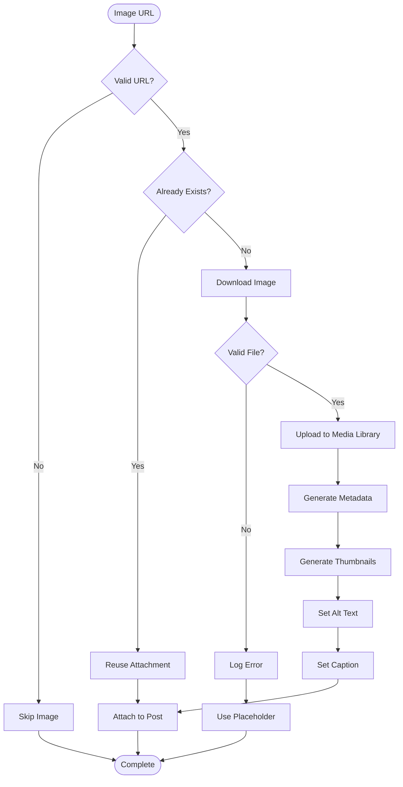

# Image Handling

## Overview

The image handling system downloads images from Untappd and imports them into the WordPress Media Library, generating thumbnails and optimizing for web use.

## Image Sources

### RSS Feed
- Sometimes contains image URL in `<description>` CDATA
- Format: `<![CDATA[]]>`

### Scraped HTML
- Image URL from `.photo img` selector
- Usually higher resolution than RSS

## Import Process

### Step-by-Step Flow



## Implementation

### Download Image

```php
function bj_download_image($url) {
    // Validate URL
    if (!filter_var($url, FILTER_VALIDATE_URL)) {
        return new WP_Error('invalid_url', __('Invalid image URL', 'beer-journal'));
    }
    
    // Download with timeout
    $response = wp_remote_get($url, [
        'timeout' => 30,
        'sslverify' => true,
    ]);
    
    if (is_wp_error($response)) {
        return $response;
    }
    
    $body = wp_remote_retrieve_body($response);
    $content_type = wp_remote_retrieve_header($response, 'content-type');
    
    // Validate content type
    if (strpos($content_type, 'image/') === false) {
        return new WP_Error('invalid_type', __('Not an image', 'beer-journal'));
    }
    
    return [
        'body' => $body,
        'content_type' => $content_type,
        'filename' => basename(parse_url($url, PHP_URL_PATH)),
    ];
}
```

### Check for Duplicates

```php
function bj_image_exists($image_url) {
    // Generate MD5 hash of URL
    $hash = md5($image_url);
    
    // Check if attachment exists with this hash
    $args = [
        'post_type' => 'attachment',
        'post_mime_type' => 'image',
        'meta_query' => [
            [
                'key' => '_bj_image_hash',
                'value' => $hash,
                'compare' => '=',
            ],
        ],
        'posts_per_page' => 1,
        'fields' => 'ids',
    ];
    
    $attachments = get_posts($args);
    
    if (!empty($attachments)) {
        return $attachments[0]; // Return existing attachment ID
    }
    
    return false;
}
```

### Import to Media Library

```php
function bj_import_image($image_url, $post_id, $args = []) {
    // Check if already exists
    $existing = bj_image_exists($image_url);
    if ($existing) {
        return $existing;
    }
    
    // Download image
    $image_data = bj_download_image($image_url);
    if (is_wp_error($image_data)) {
        error_log('Beer Journal: Failed to download image - ' . $image_data->get_error_message());
        return false;
    }
    
    // Prepare upload
    $upload_dir = wp_upload_dir();
    $filename = $image_data['filename'];
    
    // Ensure unique filename
    $filename = wp_unique_filename($upload_dir['path'], $filename);
    $file_path = $upload_dir['path'] . '/' . $filename;
    
    // Save file
    file_put_contents($file_path, $image_data['body']);
    
    // Prepare attachment data
    $attachment_data = [
        'post_mime_type' => $image_data['content_type'],
        'post_title' => sanitize_file_name(pathinfo($filename, PATHINFO_FILENAME)),
        'post_content' => '',
        'post_status' => 'inherit',
    ];
    
    // Create attachment
    $attachment_id = wp_insert_attachment($attachment_data, $file_path, $post_id);
    
    if (is_wp_error($attachment_id)) {
        error_log('Beer Journal: Failed to create attachment - ' . $attachment_id->get_error_message());
        return false;
    }
    
    // Generate metadata
    require_once(ABSPATH . 'wp-admin/includes/image.php');
    $attachment_metadata = wp_generate_attachment_metadata($attachment_id, $file_path);
    wp_update_attachment_metadata($attachment_id, $attachment_metadata);
    
    // Set alt text
    $alt_text = $args['alt'] ?? '';
    if ($alt_text) {
        update_post_meta($attachment_id, '_wp_attachment_image_alt', sanitize_text_field($alt_text));
    }
    
    // Set caption
    $caption = $args['caption'] ?? '';
    if ($caption) {
        wp_update_post([
            'ID' => $attachment_id,
            'post_excerpt' => sanitize_text_field($caption),
        ]);
    }
    
    // Store hash for duplicate detection
    update_post_meta($attachment_id, '_bj_image_hash', md5($image_url));
    update_post_meta($attachment_id, '_bj_image_source_url', esc_url_raw($image_url));
    
    return $attachment_id;
}
```

## Image Optimization

### Resize Large Images

```php
function bj_resize_image($file_path, $max_width = 1200, $max_height = 1200) {
    $image = wp_get_image_editor($file_path);
    
    if (is_wp_error($image)) {
        return $image;
    }
    
    $size = $image->get_size();
    
    // Check if resize needed
    if ($size['width'] > $max_width || $size['height'] > $max_height) {
        $image->resize($max_width, $max_height, false);
        $image->save($file_path);
    }
    
    return true;
}
```

### Generate Thumbnails

WordPress automatically generates thumbnails when `wp_generate_attachment_metadata()` is called:

- **Thumbnail**: 150×150px
- **Medium**: 300×300px
- **Large**: 1024×1024px
- **Full**: Original size

### WebP Support

If WebP is available, WordPress will generate WebP versions automatically (WordPress 5.8+).

## Error Handling

### Download Failures

```php
// Retry logic
$max_attempts = 3;
$attempt = 0;

while ($attempt < $max_attempts) {
    $image_data = bj_download_image($url);
    
    if (!is_wp_error($image_data)) {
        break;
    }
    
    $attempt++;
    if ($attempt < $max_attempts) {
        sleep(2); // Wait before retry
    }
}

if (is_wp_error($image_data)) {
    // Use placeholder
    return bj_get_placeholder_image($post_id);
}
```

### Invalid Files

```php
// Validate file type
$allowed_types = ['image/jpeg', 'image/png', 'image/gif', 'image/webp'];
if (!in_array($content_type, $allowed_types)) {
    error_log('Beer Journal: Invalid image type - ' . $content_type);
    return false;
}

// Validate file size
$max_size = 5 * 1024 * 1024; // 5MB
if (strlen($body) > $max_size) {
    error_log('Beer Journal: Image too large');
    return false;
}
```

### Placeholder Images

```php
function bj_get_placeholder_image($post_id) {
    // Use default placeholder
    $placeholder_url = plugin_dir_url(__FILE__) . 'assets/images/beer-placeholder.svg';
    
    // Or use WordPress default
    $placeholder_id = get_option('bj_placeholder_image_id');
    
    if ($placeholder_id) {
        return $placeholder_id;
    }
    
    return false; // No placeholder available
}
```

## Alt Text and Captions

### Automatic Alt Text

```php
$alt_text = sprintf(
    '%s - %s',
    $beer_name,
    $brewery_name
);
update_post_meta($attachment_id, '_wp_attachment_image_alt', sanitize_text_field($alt_text));
```

### Automatic Caption

```php
$caption = sprintf(
    __('Check-in from %s', 'beer-journal'),
    $checkin_date
);
wp_update_post([
    'ID' => $attachment_id,
    'post_excerpt' => sanitize_text_field($caption),
]);
```

## Settings

### Configuration Options

```php
// Import images to Media Library
$import_images = get_option('bj_import_images', true);

// Maximum image dimensions
$max_width = get_option('bj_image_max_width', 1200);
$max_height = get_option('bj_image_max_height', 1200);

// Generate thumbnails
$generate_thumbnails = get_option('bj_generate_thumbnails', true);

// Compress images (requires plugin)
$compress_images = get_option('bj_compress_images', false);
```

## Performance Considerations

### Lazy Loading

WordPress automatically adds `loading="lazy"` to images (WordPress 5.5+).

### Caching

- **Duplicate Detection**: Uses MD5 hash for fast lookup
- **Metadata Cache**: WordPress caches attachment metadata
- **Thumbnail Cache**: WordPress caches generated thumbnails

### Batch Processing

For historical imports, process images in batches to avoid memory issues.

## Related Documentation

- [Import Process](import-process.md)
- [RSS Sync](rss-sync.md)
- [Scraping](scraping.md)
- [Database Schema](../db/schema.md)

