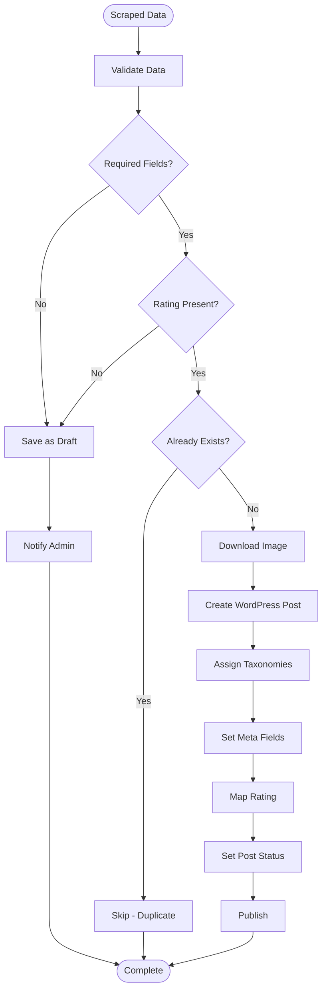

# Import Process

## Overview

The import process is responsible for taking scraped check-in data and creating WordPress posts with all associated metadata, taxonomies, and images.

## Import Flow



## Data Validation

### Required Fields

For a check-in to be published, these fields are **mandatory**:

1. **Beer Name** ✓
2. **Brewery Name** ✓
3. **Check-in Date** ✓
4. **Rating (0-5)** ✓ **CRITICAL**

### Optional Fields

These fields enhance the check-in but don't prevent publication:

- Photo
- Comment
- Beer style
- ABV % / IBU
- Serving type
- Venue
- Toast count

### Validation Logic

```php
function bj_validate_checkin_data($data) {
    $required = ['beer_name', 'brewery_name', 'date', 'rating'];
    
    foreach ($required as $field) {
        if (empty($data[$field])) {
            return new WP_Error(
                'missing_required_field',
                sprintf(__('Missing required field: %s', 'beer-journal'), $field)
            );
        }
    }
    
    // Validate rating range
    if ($data['rating'] < 0 || $data['rating'] > 5) {
        return new WP_Error('invalid_rating', __('Rating must be between 0 and 5', 'beer-journal'));
    }
    
    return true;
}
```

## Publication Rules

### Scenario A: Strict with Rating Obligatory

**Published** (`post_status = 'publish'`):
- All required fields present
- Rating is present and valid

**Draft** (`post_status = 'draft'`):
- Missing required fields
- Rating is missing or invalid
- Scraping failed after 3 attempts

### Implementation

```php
function bj_determine_post_status($data) {
    $required = ['beer_name', 'brewery_name', 'date', 'rating'];
    
    foreach ($required as $field) {
        if (empty($data[$field])) {
            return 'draft';
        }
    }
    
    // Rating is critical
    if (empty($data['rating']) || $data['rating'] < 0 || $data['rating'] > 5) {
        return 'draft';
    }
    
    return 'publish';
}
```

### Draft Reasons

When saving as draft, store the reason:

```php
if ($status === 'draft') {
    $reason = 'missing_rating';
    if (empty($data['beer_name'])) {
        $reason = 'missing_beer_name';
    } elseif (empty($data['brewery_name'])) {
        $reason = 'missing_brewery_name';
    } elseif (empty($data['rating'])) {
        $reason = 'missing_rating';
    }
    
    update_post_meta($post_id, '_bj_incomplete_reason', $reason);
}
```

## Deduplication

### Method: By Untappd Check-in ID

The plugin uses the Untappd check-in ID (extracted from GUID) to prevent duplicates.

### Implementation

```php
function bj_checkin_exists($checkin_id) {
    $args = [
        'post_type' => 'beer',
        'post_status' => 'any',
        'meta_query' => [
            [
                'key' => '_bj_checkin_id',
                'value' => $checkin_id,
                'compare' => '=',
            ],
        ],
        'posts_per_page' => 1,
        'fields' => 'ids',
    ];
    
    $posts = get_posts($args);
    return !empty($posts);
}
```

### Check-in ID Extraction

```php
// From GUID: https://untappd.com/user/jaz_on/checkin/1527514863
// Extract: 1527514863
function bj_extract_checkin_id($guid) {
    if (preg_match('/checkin\/(\d+)/', $guid, $matches)) {
        return $matches[1];
    }
    return null;
}
```

## Post Creation

### WordPress Post Data

```php
$post_data = [
    'post_title' => sprintf('%s - %s', $data['beer_name'], $data['brewery_name']),
    'post_content' => $data['comment'] ?? '',
    'post_status' => $status, // 'publish' or 'draft'
    'post_type' => 'beer',
    'post_date' => $data['date'], // Important for chronological order
    'post_author' => get_current_user_id(),
];
```

### Create Post

```php
$post_id = wp_insert_post($post_data);

if (is_wp_error($post_id)) {
    error_log('Beer Journal: Failed to create post - ' . $post_id->get_error_message());
    return $post_id;
}
```

## Taxonomy Assignment

### Auto-Creation Logic

Taxonomies are auto-created if they don't exist:

```php
function bj_assign_taxonomy($post_id, $taxonomy, $term_name) {
    if (empty($term_name)) {
        return;
    }
    
    // Normalize
    $term_name = trim($term_name);
    
    // Check if exists
    $term = term_exists($term_name, $taxonomy);
    
    if (!$term) {
        // Create new term
        $term = wp_insert_term($term_name, $taxonomy);
        
        if (is_wp_error($term)) {
            error_log('Beer Journal: Failed to create term - ' . $term->get_error_message());
            return;
        }
        
        // Log for admin notification
        $new_terms = get_option('bj_new_terms_created', []);
        $new_terms[] = [
            'taxonomy' => $taxonomy,
            'term' => $term_name,
            'term_id' => $term['term_id'],
            'created_at' => current_time('mysql'),
            'source_checkin' => $post_id,
        ];
        update_option('bj_new_terms_created', $new_terms);
    }
    
    // Assign to post
    wp_set_object_terms($post_id, $term_name, $taxonomy, true);
}
```

### Taxonomies

1. **Beer Style** (`beer_style`): Hierarchical
2. **Brewery** (`brewery`): Non-hierarchical
3. **Venue** (`venue`): Non-hierarchical (optional)

## Meta Fields

### Setting Meta Fields

```php
function bj_set_checkin_meta($post_id, $data) {
    // Identifiers
    update_post_meta($post_id, '_bj_checkin_id', $data['checkin_id']);
    update_post_meta($post_id, '_bj_beer_id', $data['beer_id'] ?? '');
    update_post_meta($post_id, '_bj_brewery_id', $data['brewery_id'] ?? '');
    update_post_meta($post_id, '_bj_checkin_url', $data['checkin_url']);
    
    // Beer data
    update_post_meta($post_id, '_bj_beer_name', $data['beer_name']);
    update_post_meta($post_id, '_bj_brewery_name', $data['brewery_name']);
    update_post_meta($post_id, '_bj_beer_style', $data['beer_style'] ?? '');
    update_post_meta($post_id, '_bj_beer_abv', $data['abv'] ?? '');
    update_post_meta($post_id, '_bj_beer_ibu', $data['ibu'] ?? '');
    update_post_meta($post_id, '_bj_beer_description', $data['description'] ?? '');
    
    // Check-in data
    update_post_meta($post_id, '_bj_rating_raw', $data['rating']);
    update_post_meta($post_id, '_bj_rating_rounded', bj_map_rating($data['rating']));
    update_post_meta($post_id, '_bj_serving_type', $data['serving_type'] ?? '');
    update_post_meta($post_id, '_bj_checkin_date', $data['date']);
    
    // Venue data
    update_post_meta($post_id, '_bj_venue_name', $data['venue_name'] ?? '');
    update_post_meta($post_id, '_bj_venue_city', $data['venue_city'] ?? '');
    update_post_meta($post_id, '_bj_venue_country', $data['venue_country'] ?? '');
    
    // Social data
    update_post_meta($post_id, '_bj_toast_count', $data['toast_count'] ?? 0);
    update_post_meta($post_id, '_bj_comment_count', $data['comment_count'] ?? 0);
    
    // Technical metadata
    update_post_meta($post_id, '_bj_source', $data['source'] ?? 'rss');
    update_post_meta($post_id, '_bj_scraped_at', current_time('mysql'));
    update_post_meta($post_id, '_bj_scraping_attempts', $data['attempts'] ?? 1);
}
```

See [Meta Fields Documentation](../db/meta-fields.md) for complete list.

## Rating Mapping

### Map Raw to Rounded

```php
function bj_map_rating($raw_rating) {
    $rules = get_option('bj_rating_rules', bj_get_default_rating_rules());
    
    foreach ($rules as $rule) {
        if ($raw_rating >= $rule['min'] && $raw_rating <= $rule['max']) {
            return $rule['round'];
        }
    }
    
    // Fallback
    return round($raw_rating);
}
```

### Default Mapping Rules

```php
function bj_get_default_rating_rules() {
    return [
        ['min' => 0.0, 'max' => 0.9, 'round' => 0],
        ['min' => 1.0, 'max' => 1.9, 'round' => 1],
        ['min' => 2.0, 'max' => 2.9, 'round' => 2],
        ['min' => 3.0, 'max' => 3.4, 'round' => 3],
        ['min' => 3.5, 'max' => 4.4, 'round' => 4],
        ['min' => 4.5, 'max' => 5.0, 'round' => 5],
    ];
}
```

See [Rating System Documentation](rating-system.md) for details.

## Image Handling

### Download and Import

```php
if (!empty($data['image_url'])) {
    $image_handler = new BJ_Image_Handler();
    $attachment_id = $image_handler->import_image($data['image_url'], $post_id, [
        'alt' => sprintf('%s - %s', $data['beer_name'], $data['brewery_name']),
        'caption' => sprintf(__('Check-in from %s', 'beer-journal'), $data['date']),
    ]);
    
    if ($attachment_id) {
        set_post_thumbnail($post_id, $attachment_id);
    }
}
```

See [Image Handling Documentation](image-handling.md) for details.

## Retry Logic

### Automatic Retry

Failed imports are automatically retried:

1. **Attempt 1**: Immediate
2. **Attempt 2**: +6 hours (via WP-Cron)
3. **Attempt 3**: +24 hours (via WP-Cron)
4. **After 3 failures**: Remains as draft

### Manual Retry

Admin can manually retry failed imports:

```php
function bj_retry_failed_imports($post_ids) {
    foreach ($post_ids as $post_id) {
        $checkin_url = get_post_meta($post_id, '_bj_checkin_url', true);
        if ($checkin_url) {
            // Re-scrape and re-import
            bj_import_checkin_from_url($checkin_url);
        }
    }
}
```

## Post-Import Actions

### Update Options

```php
// Update last check-in date
update_option('bj_last_checkin_date', $data['date']);

// Update last imported GUID
update_option('bj_last_imported_guid', $data['guid']);
```

### Clear Cache

```php
// Clear post cache
clean_post_cache($post_id);

// Clear taxonomy cache
clean_term_cache($terms, 'beer_style');
clean_term_cache($terms, 'brewery');

// Clear stats transients
delete_transient('bj_global_stats');
delete_transient('bj_top_breweries');
```

### Trigger Hooks

```php
// After single check-in imported
do_action('bj_after_checkin_imported', $post_id, $data);

// After batch import
do_action('bj_after_batch_import', $count, $imported_ids);
```

## Error Handling

### Import Errors

- **Validation Errors**: Save as draft with reason
- **Post Creation Errors**: Log and return WP_Error
- **Taxonomy Errors**: Log and continue
- **Meta Field Errors**: Log and continue
- **Image Errors**: Log and continue without image

### Logging

All errors are logged:

```php
error_log(sprintf(
    'Beer Journal: Import failed for check-in %s - %s',
    $data['checkin_id'],
    $error->get_error_message()
));
```

## Performance Considerations

### Batch Processing

For historical imports, process in batches:

- **Batch Size**: 25, 50, or 100 check-ins
- **Checkpoints**: Save progress after each batch
- **Resume**: Can resume from last checkpoint

### Optimization

- **Deduplication Check**: Use meta query with index
- **Taxonomy Assignment**: Batch operations when possible
- **Meta Updates**: Use `update_post_meta()` efficiently
- **Cache Clearing**: Only clear necessary caches

## Related Documentation

- [RSS Sync](rss-sync.md)
- [Scraping](scraping.md)
- [Rating System](rating-system.md)
- [Image Handling](image-handling.md)
- [Error Handling](../features/error-handling-detailed.md)
- [Database Schema](../db/schema.md)

