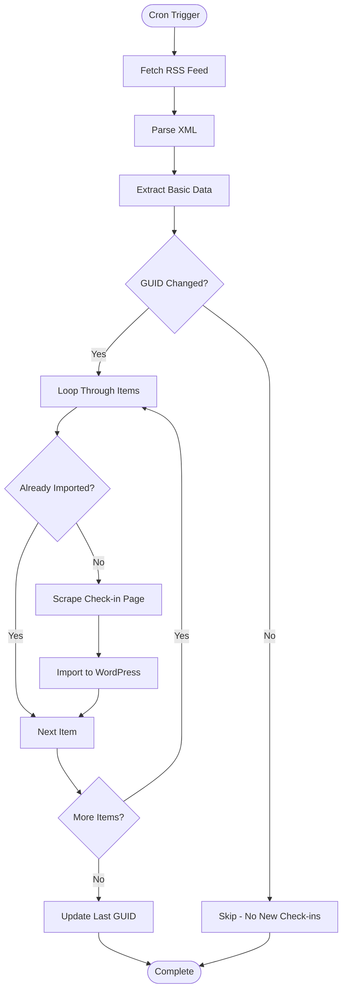

# RSS Synchronization System

## Overview

The RSS synchronization system is the primary method for automatically importing new Untappd check-ins. It uses Untappd's RSS feed to detect new check-ins and then scrapes individual pages for complete metadata.

## RSS Feed Structure

### Feed URL Format
```
https://untappd.com/rss/user/{username}
```

### RSS Item Structure
```xml
<item>
  <title>Jason is drinking a Meteor Blonde De Garde by Brasserie Meteor at Untappd at Home</title>
  <link>https://untappd.com/user/jaz_on/checkin/1527514863</link>
  <guid>https://untappd.com/user/jaz_on/checkin/1527514863</guid>
  <description>
    <!-- Sometimes contains photo in CDATA -->
    <![CDATA[]]>
  </description>
  <pubDate>Sun, 09 Nov 2025 18:13:18 +0000</pubDate>
</item>
```

### RSS Limitations

**⚠️ Critical Limitation**: The RSS feed does NOT contain:
- Rating (0-5) - **REQUIRED for publication**
- ABV % / IBU
- Beer style
- Full comment
- Serving type (Draft/Bottle/Can)
- Toast count (likes)

**Therefore**: Scraping individual check-in pages is **mandatory** for complete data.

## Adaptive Polling System

### Concept

The polling frequency adapts based on user activity to optimize resource usage:

- **Active users** (check-ins in last 7 days): Check every 6 hours
- **Moderate users** (check-ins in last 30 days): Check daily
- **Inactive users** (no check-ins in 30+ days): Check weekly

### Implementation

```php
// Get last check-in date
$last_checkin_date = get_option('bj_last_checkin_date');
$days_since_last = (time() - strtotime($last_checkin_date)) / DAY_IN_SECONDS;

// Determine schedule based on activity
if ($days_since_last < 7) {
    // Active user → frequent checks
    $cron_schedule = 'sixhourly'; // Every 6 hours
} elseif ($days_since_last < 30) {
    // Moderate activity
    $cron_schedule = 'daily'; // Once per day
} else {
    // Inactive user
    $cron_schedule = 'weekly'; // Once per week (monitoring only)
}

// Update schedule
wp_clear_scheduled_hook('bj_rss_sync');
wp_schedule_event(time(), $cron_schedule, 'bj_rss_sync');
```

### Custom Cron Schedule

WordPress doesn't have a built-in `sixhourly` schedule, so it must be registered:

```php
add_filter('cron_schedules', 'bj_add_cron_schedules');

function bj_add_cron_schedules($schedules) {
    $schedules['sixhourly'] = [
        'interval' => 6 * HOUR_IN_SECONDS,
        'display' => __('Every 6 Hours', 'beer-journal'),
    ];
    return $schedules;
}
```

## Resource Optimization

### GUID Comparison Strategy

To minimize resource usage, the system compares GUIDs before scraping:

```php
// Fetch RSS (lightweight, ~5KB)
$rss = fetch_feed($rss_url);

// Extract GUID from first item only
$latest_guid = $rss->get_items()[0]->get_id();

// Compare with last known GUID
$last_imported_guid = get_option('bj_last_imported_guid');

if ($latest_guid === $last_imported_guid) {
    // No new check-ins → SKIP (saves resources)
    error_log('Beer Journal: No new check-ins, skipping sync');
    return;
}

// New check-ins detected → full process
foreach ($rss->get_items() as $item) {
    // Scrape and import...
}
```

**Benefits**:
- RSS feed fetch: ~5KB, fast
- GUID comparison: Instant
- Scraping: Only when needed (saves bandwidth and server resources)

## Synchronization Process

### Step-by-Step Flow



### Detailed Steps

#### 1. Fetch RSS Feed
- **Component**: `BJ_RSS_Parser`
- **Method**: `fetch_feed()` (WordPress SimplePie)
- **Error Handling**: Retry up to 3 times on failure
- **Timeout**: 10 seconds

#### 2. Parse XML
- **Component**: `BJ_RSS_Parser`
- **Library**: WordPress SimplePie (built-in)
- **Extract**:
  - Title
  - Link (check-in URL)
  - GUID (unique identifier)
  - PubDate (check-in date)
  - Description (may contain image URL)

#### 3. Extract Basic Data from Title
- **Component**: `BJ_RSS_Parser`
- **Pattern**: "User is drinking a {beer_name} by {brewery_name} at {venue}"
- **Method**: Regex or string manipulation
- **Extract**:
  - Beer name
  - Brewery name
  - Venue (if present)

#### 4. Check for Duplicates
- **Component**: `BJ_Importer`
- **Method**: Query posts by `_bj_checkin_id` meta field
- **Source**: Extract ID from GUID (last part of URL)
- **If Exists**: Skip to next item
- **If New**: Continue to scraping

#### 5. Scrape Check-in Page
- **Component**: `BJ_Scraper`
- **URL**: From RSS link
- **Purpose**: Extract complete metadata (rating, ABV, style, etc.)
- **See**: [Scraping Documentation](scraping.md)

#### 6. Import to WordPress
- **Component**: `BJ_Importer`
- **Process**: Create post, assign taxonomies, set meta fields
- **See**: [Import Process Documentation](import-process.md)

#### 7. Update Last GUID
- **Component**: `BJ_RSS_Parser`
- **Option**: `bj_last_imported_guid`
- **Purpose**: Track last imported check-in for next sync

## Error Handling

### Network Errors
- **Retry Logic**: Up to 3 attempts
- **Delay**: Exponential backoff (1s, 2s, 4s)
- **Logging**: All errors logged to `wp-content/uploads/beer-journal/logs/`

### Scraping Failures
- **Result**: Check-in saved as draft
- **Reason**: Stored in `_bj_incomplete_reason` meta field
- **Notification**: Admin notified via dashboard notice
- **Retry**: Automatic retry scheduled (3 attempts over 24 hours)

### RSS Feed Errors
- **Invalid URL**: User notification in admin
- **Feed Unavailable**: Logged, retry on next schedule
- **Parse Errors**: Logged, skip problematic items

## Logging

### Log File Location

**Note**: All logs are written to a unified log file. See [Logging Strategy](../development/logging-strategy.md) for details.

```
wp-content/uploads/beer-journal/logs/beer-journal-{YYYY-MM-DD}.log
```

### Log Format
```
[2025-11-10 03:14:22] INFO: RSS sync started
[2025-11-10 03:14:23] INFO: Fetched RSS feed (25 items)
[2025-11-10 03:14:23] INFO: Latest GUID: 1527514863
[2025-11-10 03:14:23] INFO: No new check-ins, skipping sync
[2025-11-10 03:14:23] INFO: RSS sync completed
```

### Log Levels
- **INFO**: Normal operations
- **WARNING**: Non-critical issues
- **ERROR**: Failures requiring attention
- **DEBUG**: Detailed information (only if debug mode enabled)

## Configuration

### Settings
- **RSS Feed URL**: User-provided Untappd RSS URL
- **Sync Frequency**: Adaptive (automatic) or manual override
- **Notifications**: Email on sync completion/errors
- **Debug Mode**: Enable detailed logging

### WordPress Options
- `bj_rss_feed_url`: RSS feed URL
- `bj_last_checkin_date`: Date of last imported check-in
- `bj_last_imported_guid`: GUID of last imported check-in
- `bj_sync_enabled`: Whether sync is enabled
- `bj_sync_frequency`: Manual frequency override (optional)

## Performance Considerations

### Optimization Strategies
1. **GUID Comparison**: Skip scraping when no new check-ins
2. **Batch Processing**: Process multiple items efficiently
3. **Caching**: Cache RSS feed for short duration (5 minutes)
4. **Rate Limiting**: Respect Untappd servers (delay between requests)

### Resource Usage
- **RSS Fetch**: ~5KB, <1 second
- **GUID Check**: <0.1 seconds
- **Scraping**: ~50KB per check-in, 2-5 seconds (with delay)
- **Total**: Minimal if no new check-ins, reasonable if new check-ins

## Related Documentation

- [Architecture Overview](overview.md)
- [Scraping System](scraping.md)
- [Import Process](import-process.md)
- [Error Handling](../features/error-handling-detailed.md)
- [Polling Adaptive](../features/polling-adaptive.md)

