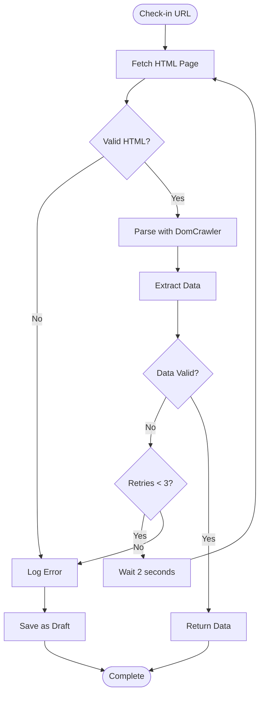

# HTML Scraping System

## Overview

Since Untappd doesn't provide an official API, the plugin scrapes HTML pages to extract complete check-in metadata. The RSS feed only contains basic information, so scraping is **mandatory** for complete data.

## Why Scraping is Required

### RSS Feed Limitations
The RSS feed only provides:
- Basic beer and brewery names
- Check-in URL
- Date
- Sometimes an image URL

### Missing Critical Data
The RSS feed does **NOT** contain:
- **Rating (0-5)** - **REQUIRED for publication**
- ABV % / IBU
- Beer style
- Full user comment
- Serving type (Draft/Bottle/Can)
- Toast count (likes)
- Comment count

**Therefore**: Scraping individual check-in pages is essential.

## Technology Stack

### Libraries
- **Symfony DomCrawler**: HTML parsing and DOM manipulation
- **Symfony CSS Selector**: CSS selector support
- **Guzzle HTTP Client**: HTTP requests with proper headers

### WordPress Integration
- Uses WordPress HTTP API (`wp_remote_get()`) when possible
- Falls back to Guzzle for complex scenarios

## HTML Structure (Untappd)

### Check-in Page Structure
```
<div class="checkin-info">
  <div class="beer-details">
    <h2>Beer Name</h2>
    <p>Brewery Name</p>
    <span>Beer Style</span>
  </div>
  <div class="details">
    <span>ABV: 5.5%</span>
    <span>IBU: 45</span>
  </div>
  <div class="rating-serving">
    <div class="rating">4.25</div>
    <span>Serving Type: Draft</span>
  </div>
  <div class="photo">
    
  </div>
  <div class="checkin-comment">
    User's comment text here...
  </div>
  <div class="venue-name">
    Venue Name
  </div>
  <div class="caps">
    <span class="count">12</span> toasts
  </div>
</div>
```

## CSS Selectors

### Key Selectors

```php
$selectors = [
    'checkin_info' => '.checkin-info',           // Main container
    'beer_details' => '.beer-details',           // Beer name, brewery, style
    'details' => '.details',                     // ABV, IBU
    'rating_serving' => '.rating-serving',       // Rating + serving type
    'photo' => '.photo',                         // Image
    'checkin_comment' => '.checkin-comment',    // User comment
    'venue_name' => '.venue-name',               // Venue
    'toast_count' => '.caps .count',            // Toast count
];
```

### Data Extraction

```php
// Example extraction
$crawler = new Crawler($html);

// Rating (REQUIRED)
$rating = $crawler->filter('.rating-serving .rating')->text();
$rating = floatval(trim($rating)); // Convert to float

// Beer name
$beer_name = $crawler->filter('.beer-details h2')->text();

// Brewery name
$brewery_name = $crawler->filter('.beer-details p')->text();

// Beer style
$beer_style = $crawler->filter('.beer-details span')->text();

// ABV
$abv_text = $crawler->filter('.details')->text();
$abv = preg_match('/ABV:\s*([\d.]+)%/', $abv_text, $matches) ? floatval($matches[1]) : null;

// IBU
$ibu = preg_match('/IBU:\s*(\d+)/', $abv_text, $matches) ? intval($matches[1]) : null;

// Serving type
$serving_type = $crawler->filter('.rating-serving span')->text();

// Image URL
$image_url = $crawler->filter('.photo img')->attr('src');

// Comment
$comment = $crawler->filter('.checkin-comment')->text();

// Venue
$venue = $crawler->filter('.venue-name')->text();

// Toast count
$toast_count = intval($crawler->filter('.caps .count')->text());
```

## Scraping Process

### Step-by-Step



### Implementation Details

#### 1. Fetch HTML Page
```php
$response = wp_remote_get($checkin_url, [
    'timeout' => 10,
    'user-agent' => 'Jardin Toasts WordPress Plugin',
    'headers' => [
        'Accept' => 'text/html,application/xhtml+xml',
    ],
]);

if (is_wp_error($response)) {
    return new WP_Error('fetch_failed', $response->get_error_message());
}

$html = wp_remote_retrieve_body($response);
```

#### 2. Parse with DomCrawler
```php
use Symfony\Component\DomCrawler\Crawler;

$crawler = new Crawler($html);
```

#### 3. Extract Data
- Use CSS selectors to find elements
- Extract text content
- Parse numbers and dates
- Handle missing data gracefully

#### 4. Validate Data
- Check for required fields (rating, beer name, brewery)
- Validate data types
- Sanitize all input

## Rate Limiting

### Importance
- **Respect Untappd servers**: Avoid overwhelming with requests
- **Prevent IP bans**: Too many requests can result in blocking
- **Be a good citizen**: Follow ethical scraping practices

### Implementation
```php
// Delay between requests
$delay = get_option('jb_scraping_delay', 3); // Default 3 seconds
sleep($delay);

// Or use WordPress transients for rate limiting
$last_request = get_transient('jb_last_scrape_request');
if ($last_request && (time() - $last_request) < $delay) {
    $wait = $delay - (time() - $last_request);
    sleep($wait);
}
set_transient('jb_last_scrape_request', time(), 60);
```

### Recommended Delays
- **RSS Sync**: 2-3 seconds between check-ins
- **Historical Import**: 3-5 seconds between check-ins
- **Retry Attempts**: 5-10 seconds between retries

## Error Handling

### Network Errors
- **Timeout**: Retry with longer timeout
- **Connection Refused**: Wait and retry
- **HTTP Errors**: Log and handle appropriately

### Parsing Errors
- **Missing Elements**: Use fallback values or skip
- **Invalid Data**: Log and continue
- **HTML Changes**: Log warning for admin review

### Retry Logic
```php
$max_attempts = 3;
$attempt = 0;

while ($attempt < $max_attempts) {
    $data = jb_scrape_checkin($url);
    
    if (!is_wp_error($data)) {
        return $data;
    }
    
    $attempt++;
    if ($attempt < $max_attempts) {
        sleep(pow(2, $attempt)); // Exponential backoff
    }
}

// All attempts failed
return new WP_Error('scraping_failed', 'Failed after 3 attempts');
```

## Data Validation

### Required Fields
- **Rating**: Must be between 0 and 5
- **Beer Name**: Must not be empty
- **Brewery Name**: Must not be empty

### Optional Fields
- ABV, IBU, Style, Comment, Venue, etc.
- Missing optional fields don't prevent import

### Sanitization
```php
// Text fields
$beer_name = sanitize_text_field($raw_beer_name);

// Numbers
$rating = floatval($raw_rating);
$abv = abs(floatval($raw_abv));
$ibu = absint($raw_ibu);

// URLs
$image_url = esc_url_raw($raw_image_url);

// Rich text (comments)
$comment = wp_kses_post($raw_comment);
```

## Handling HTML Changes

### Risk
Untappd may change their HTML structure at any time, breaking selectors.

### Mitigation Strategies
1. **Multiple Selectors**: Try multiple selector patterns
2. **Fallback Values**: Use defaults when data missing
3. **Logging**: Log warnings when selectors fail
4. **Admin Notifications**: Alert admin of scraping issues
5. **Graceful Degradation**: Import what's available, save rest as draft

### Example Fallback
```php
// Try primary selector
$rating = $crawler->filter('.rating-serving .rating')->text();

// If empty, try alternative
if (empty($rating)) {
    $rating = $crawler->filter('[data-rating]')->attr('data-rating');
}

// If still empty, log warning
if (empty($rating)) {
    error_log('Jardin Toasts: Could not extract rating from ' . $url);
    // Save as draft with reason
}
```

## Performance Optimization

### Caching
- **Don't cache HTML**: Always fetch fresh data
- **Cache parsed data**: Cache extracted data for failed retries

### Parallel Processing
- **Not recommended**: Respect rate limits
- **Sequential**: Process one check-in at a time

### Timeout Management
- **Default**: 10 seconds per request
- **Adjustable**: Based on server performance

## Security Considerations

### User-Agent
- **Identify**: Use descriptive user-agent
- **Example**: "Jardin Toasts WordPress Plugin/1.0.0"

### Headers
- **Accept**: Specify HTML content type
- **Referer**: Optional, may help with some sites

### Input Validation
- **URLs**: Validate Untappd URLs only
- **Sanitize**: All extracted data

## Related Documentation

- [RSS Sync](rss-sync.md)
- [Import Process](import-process.md)
- [Error Handling](../features/error-handling-detailed.md)
- [Scraping Detailed](../features/scraping-detailed.md)

