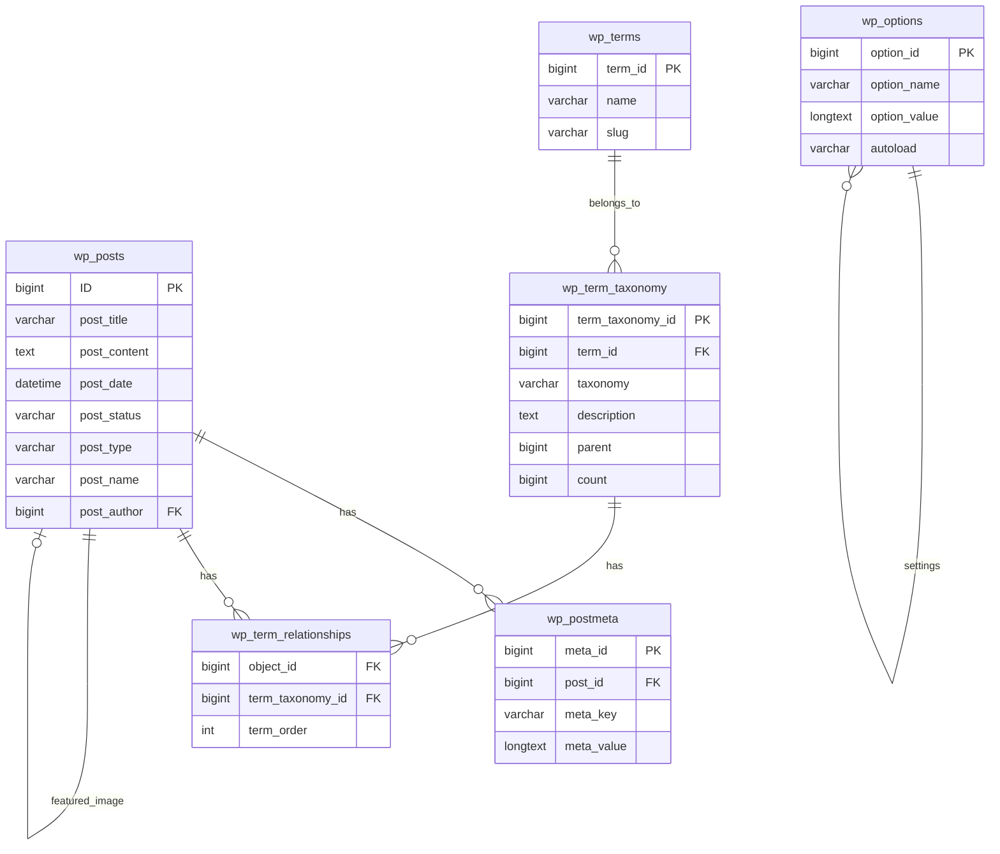

# Entity Relationship Diagram (ERD)

## Overview

This ERD shows the relationships between WordPress core tables and how Jardin Toasts uses them to store check-in data.

## ERD Diagram



## Relationships Explained

### Posts → Post Meta (One-to-Many)
- One `beer` post has many meta fields
- Each meta field is stored as a row in `wp_postmeta`
- Meta keys are prefixed with `_jb_` (e.g., `_jb_checkin_id`, `_jb_rating_raw`)

**Example**:
```
Post ID: 123
├── _jb_checkin_id: "1527514863"
├── _jb_beer_name: "Meteor Blonde De Garde"
├── _jb_brewery_name: "Brasserie Meteor"
├── _jb_rating_raw: "4.25"
└── _jb_rating_rounded: "4"
```

### Posts → Taxonomies (Many-to-Many)
- One `beer` post can have multiple taxonomy terms
- Relationship is through `wp_term_relationships`
- Terms are stored in `wp_terms` and `wp_term_taxonomy`

**Example**:
```
Post ID: 123
├── beer_style: "IPA" (term_id: 5)
├── brewery: "Brasserie Meteor" (term_id: 12)
└── venue: "Home" (term_id: 8)
```

### Posts → Featured Image (One-to-One)
- One `beer` post has one featured image
- Featured image is an attachment post (post_type: 'attachment')
- Relationship is through `wp_postmeta` with key `_thumbnail_id`

**Example**:
```
Post ID: 123
└── _thumbnail_id: 456 (attachment post ID)
```

### Terms → Term Taxonomy (One-to-One)
- Each term has one taxonomy definition
- `wp_terms` stores the term name and slug
- `wp_term_taxonomy` stores taxonomy type and hierarchy

**Example**:
```
Term: "IPA"
├── wp_terms: { term_id: 5, name: "IPA", slug: "ipa" }
└── wp_term_taxonomy: { term_id: 5, taxonomy: "beer_style", parent: 0 }
```

### Hierarchical Taxonomies
- `beer_style` is hierarchical (like categories)
- Parent-child relationship is stored in `wp_term_taxonomy.parent`

**Example**:
```
IPA (term_id: 5, parent: 0)
└── American IPA (term_id: 6, parent: 5)
    └── Double IPA (term_id: 7, parent: 6)
```

## Data Model

### Check-in Entity
```
beer (wp_posts)
├── Basic Info
│   ├── post_title: "Beer Name - Brewery Name"
│   ├── post_content: "User comment"
│   ├── post_date: "2025-11-10 18:13:18"
│   └── post_status: "publish" | "draft"
│
├── Meta Fields (wp_postmeta)
│   ├── Identifiers
│   │   ├── _jb_checkin_id: "1527514863"
│   │   ├── _jb_beer_id: "12345"
│   │   ├── _jb_brewery_id: "6789"
│   │   └── _jb_checkin_url: "https://untappd.com/..."
│   │
│   ├── Beer Data
│   │   ├── _jb_beer_name: "Meteor Blonde De Garde"
│   │   ├── _jb_brewery_name: "Brasserie Meteor"
│   │   ├── _jb_beer_style: "Blonde Ale"
│   │   ├── _jb_beer_abv: "5.5"
│   │   ├── _jb_beer_ibu: "25"
│   │   └── _jb_beer_description: "Beer description..."
│   │
│   ├── Check-in Data
│   │   ├── _jb_rating_raw: "4.25"
│   │   ├── _jb_rating_rounded: "4"
│   │   ├── _jb_serving_type: "Draft"
│   │   └── _jb_checkin_date: "2025-11-10T18:13:18Z"
│   │
│   ├── Venue Data
│   │   ├── _jb_venue_name: "Home"
│   │   ├── _jb_venue_city: "Strasbourg"
│   │   └── _jb_venue_country: "France"
│   │
│   ├── Social Data
│   │   ├── _jb_toast_count: "12"
│   │   └── _jb_comment_count: "3"
│   │
│   └── Technical
│       ├── _jb_source: "rss"
│       ├── _jb_scraped_at: "2025-11-10 18:15:00"
│       └── _jb_scraping_attempts: "1"
│
├── Taxonomies (wp_term_relationships)
│   ├── beer_style: "Blonde Ale" (term_id: 10)
│   ├── brewery: "Brasserie Meteor" (term_id: 12)
│   └── venue: "Home" (term_id: 8)
│
└── Featured Image (wp_posts as attachment)
    └── Attachment ID: 456
        ├── _wp_attached_file: "2025/11/beer-photo.jpg"
        ├── _wp_attachment_image_alt: "Meteor Blonde De Garde - Brasserie Meteor"
        └── _jb_image_hash: "md5_hash_of_url"
```

## Query Examples

### Get Check-in with All Data
```sql
SELECT 
    p.ID,
    p.post_title,
    p.post_content,
    p.post_date,
    p.post_status,
    pm.meta_key,
    pm.meta_value
FROM wp_posts p
LEFT JOIN wp_postmeta pm ON p.ID = pm.post_id
WHERE p.post_type = 'beer'
AND p.ID = 123
AND pm.meta_key LIKE '_jb_%'
```

### Get Check-ins by Beer Style
```sql
SELECT p.*
FROM wp_posts p
INNER JOIN wp_term_relationships tr ON p.ID = tr.object_id
INNER JOIN wp_term_taxonomy tt ON tr.term_taxonomy_id = tt.term_taxonomy_id
INNER JOIN wp_terms t ON tt.term_id = t.term_id
WHERE p.post_type = 'beer'
AND p.post_status = 'publish'
AND tt.taxonomy = 'beer_style'
AND t.slug = 'ipa'
```

### Get Average Rating
```sql
SELECT AVG(CAST(pm.meta_value AS DECIMAL(3,2))) as avg_rating
FROM wp_postmeta pm
INNER JOIN wp_posts p ON pm.post_id = p.ID
WHERE p.post_type = 'beer'
AND p.post_status = 'publish'
AND pm.meta_key = '_jb_rating_raw'
```

## Related Documentation

- [Schema Documentation](schema.md)
- [Meta Fields](meta-fields.md)
- [Options](options.md)
- [Indexes](indexes.md)

