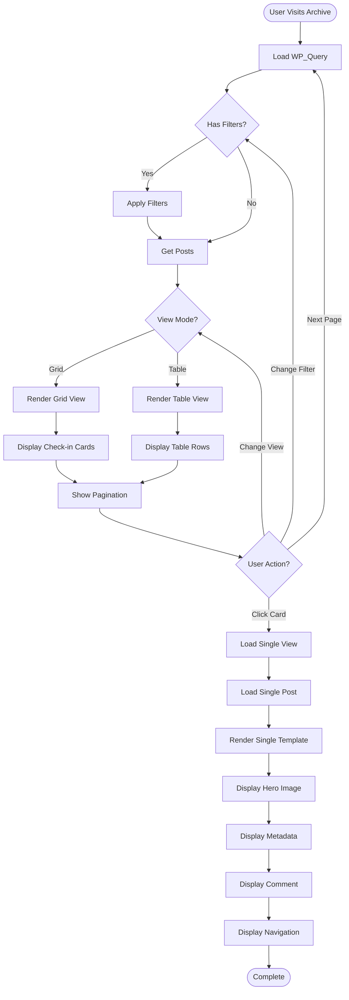

# Check-in Display Flow

## Overview

This document describes how check-ins are displayed on the frontend, from archive to single view.

## Display Flow

## Archive View

### Grid View (Default)

**Layout**:
- Desktop: 3 columns
- Tablet: 2 columns
- Mobile: 1 column

**Card Components**:
1. Beer image (if available)
2. Rating stars
3. Beer name
4. Brewery name
5. Beer style
6. ABV % (if available)
7. Venue and date

**User Interactions**:
- Click card → Navigate to single view
- Hover → Show additional details
- Toggle view → Switch to table view

---

### Table View

**Layout**:
- All columns visible
- Sortable columns
- Scrollable on mobile

**Columns**:
- Photo (thumbnail)
- Beer Name
- Brewery
- Style
- Rating
- ABV
- Date
- Venue

**User Interactions**:
- Click column header → Sort by column
- Click row → Navigate to single view
- Toggle view → Switch to grid view

---

### Filters

**Available Filters**:
- Beer Style (dropdown)
- Brewery (dropdown)
- Rating (slider: 0-5 stars)
- Date Range (date picker)

**Filter Application**:
1. User selects filter criteria
2. AJAX request sent (or page reload)
3. Query modified with filter parameters
4. Results updated

---

### Search

**Full-Text Search**:
- Searches: Beer name, brewery name, comment
- Real-time results (AJAX)
- Highlights matching terms

---

## Single View

### Hero Section

**Components**:
- Large beer image (if available)
- Beer name and brewery
- Rating display

---

### Main Content

**Left Column**:
- User comment (if present)
- Full text with formatting

**Right Column (Sidebar)**:
- Metadata "data sheet":
  - Beer style
  - ABV %
  - IBU
  - Serving type
  - Check-in date
  - Venue information
  - Toast count
  - Comment count

---

### Navigation

**Previous/Next Check-ins**:
- Navigate chronologically
- Show beer name and rating
- Keyboard shortcuts (arrow keys)

---

### Related Check-ins

**Display**:
- "Other beers from this brewery"
- Grid of related check-ins
- Links to related check-ins

---

## Template Loading

### Hierarchy

1. Theme override: `jardin-toasts/archive-beer.php`
2. Theme: `archive-beer.php`
3. Plugin default: `public/templates/archive-beer.php`

See [Template Hierarchy Documentation](../frontend/template-hierarchy.md)

---

## Performance Optimization

### Lazy Loading

**Images**:
- `loading="lazy"` attribute
- Load on scroll into viewport

**Pagination**:
- Load 24 check-ins per page
- AJAX pagination (optional)

---

### Caching

**Query Results**:
- Cache WP_Query results
- Clear on new check-in import

**Template Output**:
- Object cache for expensive operations
- Transients for statistics

---

## Responsive Behavior

### Desktop (> 768px)

- 3-column grid
- Full table with all columns
- Sidebar visible

---

### Tablet (481-768px)

- 2-column grid
- Scrollable table
- Sidebar below content

---

### Mobile (< 480px)

- 1-column list
- Stacked cards
- Collapsible filters
- Full-width images

---

## User Interactions

### View Toggle

**Action**: Click Grid/Table toggle button

**Result**: 
- Switch between grid and table views
- Maintain current filters
- Preserve scroll position (if possible)

---

### Filter Application

**Action**: Select filter criteria and apply

**Result**:
- Query modified
- Results updated
- URL updated (for sharing)
- Filters persisted in session

---

### Sorting

**Action**: Click column header

**Result**:
- Sort by selected column
- Toggle ascending/descending
- Update display

---

### Pagination

**Action**: Click page number or next/previous

**Result**:
- Load next page of results
- Maintain filters
- Scroll to top

---

## Related Documentation

- [Templates](../frontend/templates.md)
- [Template Tags](../frontend/template-tags.md)
- [Styling](../frontend/styling.md)

