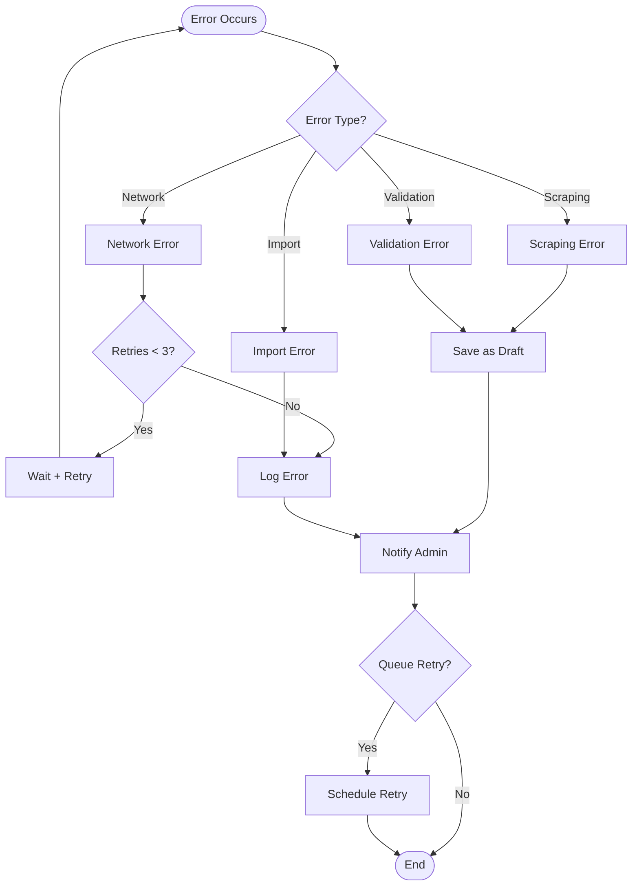

# Error Handling Flow

## Overview

This document describes how errors are handled throughout the plugin, from detection to resolution.

## Error Handling Flow



## Error Types

### Network Errors

**Causes**:
- RSS feed unavailable
- Check-in page unreachable
- Timeout
- Connection refused

**Handling**:
1. Retry up to 3 times
2. Exponential backoff (1s, 2s, 4s)
3. Log error with details
4. Notify admin if persistent

**Resolution**:
- Check internet connection
- Verify URLs
- Retry manually

---

### Scraping Errors

**Causes**:
- HTML structure changed
- Selectors no longer match
- Missing required elements
- Invalid data format

**Handling**:
1. Log warning with selector details
2. Save check-in as draft
3. Store reason in `_jb_incomplete_reason`
4. Schedule retry (3 attempts over 24 hours)
5. Notify admin

**Resolution**:
- Update selectors in code
- Manually retry failed imports
- Review logs for patterns

---

### Validation Errors

**Causes**:
- Missing required fields (rating, beer name, etc.)
- Invalid data format
- Out of range values

**Handling**:
1. Save as draft
2. Store reason in `_jb_incomplete_reason`
3. Log validation errors
4. Notify admin

**Resolution**:
- Review draft check-ins
- Manually complete missing data
- Retry import

---

### Import Errors

**Causes**:
- Database errors
- Permission issues
- Memory limits
- Plugin conflicts

**Handling**:
1. Log error with details
2. Return WP_Error
3. Notify admin immediately
4. Do not save partial data

**Resolution**:
- Check database permissions
- Increase PHP memory limit
- Review plugin conflicts
- Check error logs

---

## Retry Logic

### Automatic Retry

**Network Errors**:
- Attempt 1: Immediate
- Attempt 2: +1 second
- Attempt 3: +2 seconds
- After 3 failures: Log and notify

**Scraping Errors**:
- Attempt 1: Immediate
- Attempt 2: +6 hours (WP-Cron)
- Attempt 3: +24 hours (WP-Cron)
- After 3 failures: Remain as draft

---

### Manual Retry

**Admin Interface**:
- "Retry Failed Imports" button
- Select specific check-ins
- Force immediate retry
- Bypass retry limit

---

## Error Logging

### Log File Location

```
wp-content/uploads/jardin-toasts/logs/
└── jardin-toasts-2025-11-10.log

**Note**: All plugin logs (RSS sync, scraping, imports, errors) are written to a unified log file. See [Logging Strategy](../../development/logging-strategy.md) for details.
```

### Log Format

```
[2025-11-10 18:15:23] ERROR: Failed to scrape check-in 1527514863
[2025-11-10 18:15:23] ERROR: Selector .rating-serving not found
[2025-11-10 18:15:23] WARNING: Check-in saved as draft (missing_rating)
```

### Log Levels

- **INFO**: Normal operations
- **WARNING**: Non-critical issues
- **ERROR**: Failures requiring attention
- **DEBUG**: Detailed information (debug mode only)

---

## Admin Notifications

### Dashboard Notices

**Types**:
- Success: "X check-ins imported successfully"
- Warning: "X check-ins saved as drafts"
- Error: "Import failed: [reason]"

**Display**:
- Dismissible notices
- Link to relevant pages
- Action buttons (Retry, View Logs)

---

### Email Notifications

**Triggers**:
- Sync completion (if enabled)
- Errors (if enabled)
- Persistent failures

**Content**:
- Summary of operations
- Error details
- Links to admin pages
- Action items

---

## Draft Management

### Draft Reasons

Stored in `_jb_incomplete_reason` meta field:

- `missing_rating`: Rating not found
- `missing_beer_name`: Beer name not found
- `missing_brewery_name`: Brewery name not found
- `scraping_failed`: Scraping failed after 3 attempts
- `validation_failed`: Data validation failed

---

### Draft Review

**Admin Interface**:
- Filter posts by status: draft
- Filter by incomplete reason
- Bulk actions: Retry, Delete, Publish (if complete)

---

## Error Recovery

### Automatic Recovery

**Scenarios**:
- Temporary network issues: Auto-retry succeeds
- Transient errors: Resolved on retry
- Rate limiting: Wait and retry

---

### Manual Recovery

**Actions**:
1. Review error logs
2. Identify root cause
3. Fix issue (if code-related)
4. Retry failed imports (with multiple selection)
5. Review and publish drafts

#### Bulk Retry Process

1. Navigate to Jardin Toasts admin page
2. Filter by status: "Draft"
3. Select one or more draft check-ins using checkboxes
4. Choose "Retry Selected" from bulk actions dropdown
5. Click "Apply"
6. Plugin re-scrapes selected check-ins immediately
7. Successfully scraped items are published automatically
8. Failed items remain as drafts with updated error information

---

## Best Practices

### Error Prevention

- Validate all input
- Sanitize all data
- Check system requirements
- Test with various data formats
- Handle edge cases

### Error Handling

- Always log errors
- Provide user-friendly messages
- Don't expose sensitive information
- Allow manual recovery
- Notify admins of critical errors

---

## Related Documentation

- [RSS Sync Flow](sync.md)
- [Historical Import Flow](historical-import.md)
- [Error Handling Architecture](../features/error-handling-detailed.md)

