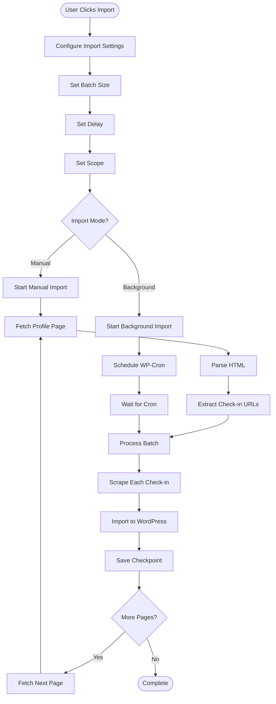

# Historical Import Flow

## Overview

This document describes the process of importing historical check-ins from Untappd using the manual crawler.

## Import Flow



## Detailed Steps

### Step 1: Access Import Page

**Location**: `Beer Journal > Settings > Historical Import`

**Actions**:
1. User navigates to import page
2. Sees import interface with configuration options

---

### Step 2: Configure Import Settings

**Settings**:

1. **Untappd Profile URL**:
   - Format: `https://untappd.com/user/{username}`
   - Required field

2. **Batch Size**:
   - Options: 25, 50, 100 check-ins per batch
   - Default: 25
   - Recommendation: 25 for manual, 50-100 for background

3. **Delay Between Requests**:
   - Options: 2-5 seconds
   - Default: 3 seconds
   - Purpose: Respect rate limits

4. **Import Scope**:
   - All check-ins
   - Limit to X pages
   - From specific date

5. **Import Mode**:
   - Manual (recommended for ~200 check-ins)
   - Background (WP-Cron, for large imports)

---

### Step 3: Start Import

**Manual Mode**:
1. User clicks "Start Import"
2. Browser stays open
3. Process runs synchronously
4. Progress bar updates in real-time
5. AJAX calls every 5 seconds for progress

**Background Mode**:
1. User clicks "Start Background Import"
2. WP-Cron takes over
3. One batch per hour
4. Email notification when complete

---

### Step 4: Fetch Profile Page

**Actions**:
1. Fetch HTML from Untappd profile URL
2. Parse HTML to find check-in links
3. Extract check-in URLs
4. Handle pagination (25 check-ins per page)

**Rate Limiting**: Delay between requests (2-5 seconds)

---

### Step 5: Process Batch

**Loop**: For each check-in in batch

**Actions**:
1. Scrape check-in page (see [Scraping Flow](../architecture/scraping.md))
2. Extract complete data
3. Import to WordPress
4. Update progress counter

**Progress Tracking**:
- Check-ins processed: X / Y
- Images imported: X / Y
- Taxonomies created: X styles, Y breweries
- Time elapsed: X minutes
- ETA: X minutes remaining

---

### Step 6: Save Checkpoint

**Purpose**: Allow resume after interruption

**Actions**:
1. After each batch, save checkpoint:
   - Current page number
   - Total imported count
   - Last check-in ID
   - Start timestamp
2. Store in `bj_import_checkpoint` option

**Checkpoint Structure**:
```php
[
    'current_page' => 3,
    'total_imported' => 75,
    'last_checkin_id' => '123456',
    'started_at' => 1699632000,
]
```

---

### Step 7: Continue or Complete

**If More Pages**:
1. Fetch next page
2. Process next batch
3. Repeat until all pages processed

**If Complete**:
1. Clear checkpoint
2. Display completion message
3. Show statistics:
   - Total imported
   - Errors/drafts
   - Time taken
4. Send email notification (if enabled)

---

## Manual Mode Details

### Real-Time Progress

**Interface Updates**:
- Progress bar: X% complete
- Statistics: Updated every 5 seconds via AJAX
- Logs: Real-time log display
- ETA: Calculated based on current speed

**User Actions**:
- Pause: Temporarily stop import
- Resume: Continue from checkpoint
- Cancel: Stop and clear checkpoint

### Timeout Handling

**PHP Timeout** (30 seconds default):
- If batch takes too long, process stops
- Checkpoint saved automatically
- User can resume from last checkpoint

**Browser Timeout**:
- Manual mode limited by browser session
- Recommendation: Use background mode for large imports

---

## Background Mode Details

### WP-Cron Scheduling

**Process**:
1. First batch scheduled immediately
2. Subsequent batches scheduled hourly
3. Each batch processes configured batch size
4. Checkpoint updated after each batch

**Advantages**:
- No browser timeout
- Can process thousands of check-ins
- Runs in background
- Email notification when complete

**Disadvantages**:
- Slower (1 batch per hour)
- Requires WP-Cron to be working
- Less real-time feedback

---

## Error Handling

### Network Errors

**Actions**:
- Retry up to 3 times
- If fails: Skip check-in, log error
- Continue with next check-in

---

### Scraping Failures

**Actions**:
- Save check-in as draft
- Log error with reason
- Continue with next check-in
- Add to retry queue

---

### Timeout Errors

**Actions**:
- Save checkpoint
- Display message: "Import paused due to timeout"
- Provide "Resume" button
- User can resume from checkpoint

---

## Resume Functionality

### Resume from Checkpoint

**Actions**:
1. User clicks "Resume Import"
2. Load checkpoint data
3. Continue from last processed page
4. Skip already imported check-ins (deduplication)

**Deduplication**:
- Check `_bj_checkin_id` before importing
- Skip if already exists

---

## Progress Tracking

### Statistics Displayed

- **Check-ins Processed**: X / Y
- **Images Imported**: X / Y
- **Taxonomies Created**: 
  - X beer styles
  - Y breweries
  - Z venues
- **Time Elapsed**: X minutes Y seconds
- **Estimated Time Remaining**: X minutes

### Calculation

```php
$elapsed = time() - $start_time;
$rate = $processed / $elapsed; // check-ins per second
$remaining = ($total - $processed) / $rate; // seconds remaining
```

---

## Completion

### Success Indicators

- All pages processed
- All check-ins imported (or saved as drafts)
- Checkpoint cleared
- Statistics displayed

### Final Statistics

- Total check-ins: X
- Successfully imported: Y
- Saved as drafts: Z
- Errors: W
- Time taken: X minutes
- Average speed: Y check-ins/minute

---

## Best Practices

### For ~200 Check-ins

- **Mode**: Manual
- **Batch Size**: 25
- **Delay**: 3 seconds
- **Estimated Time**: 10-15 minutes

### For Large Imports (1000+)

- **Mode**: Background
- **Batch Size**: 50-100
- **Delay**: 3-5 seconds
- **Estimated Time**: Several hours (1 batch/hour)

---

## Related Documentation

- [Scraping Architecture](../architecture/scraping.md)
- [Import Process](../architecture/import-process.md)
- [Error Handling Flow](error-handling.md)

