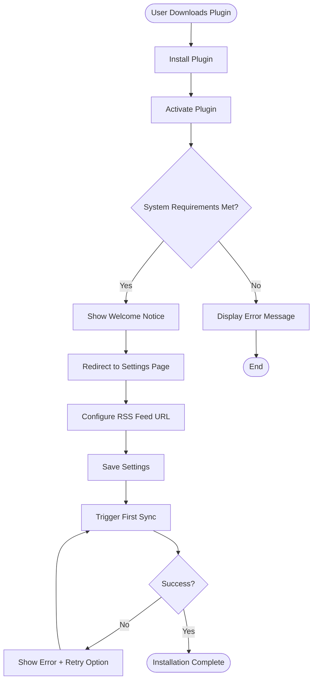

# Installation and Configuration Flow

## Overview

This document describes the complete flow from plugin installation to initial configuration and first sync.

## Installation Flow

## Detailed Steps

### Step 1: Plugin Installation

**Methods**:
- WordPress.org plugin directory
- Manual upload via admin
- FTP upload

**Actions**:
1. Upload plugin files to `/wp-content/plugins/jardin-toasts/`
2. WordPress detects plugin

---

### Step 2: Plugin Activation

**Actions**:
1. Go to Plugins page
2. Click "Activate" on Jardin Toasts
3. Plugin activation hook runs:
   - Create database indexes (if needed)
   - Set default options
   - Register Custom Post Type
   - Register taxonomies

**System Check**:
- PHP version (8.2+)
- WordPress version (6.0+)
- Required PHP extensions (curl, dom, json, mbstring)

---

### Step 3: Welcome and Initial Setup

**Actions**:
1. Admin notice displayed: "Jardin Toasts activated! Configure your RSS feed to start syncing."
2. Link to settings page
3. User clicks "Go to Settings"

---

### Step 4: Settings Configuration

**Settings Page**: `Jardin Toasts > Settings > Synchronization`

**Required Configuration**:
1. **RSS Feed URL**: 
   - Format: `https://untappd.com/rss/user/{username}`
   - User enters their Untappd username
   - Plugin validates URL format

2. **Sync Frequency** (optional):
   - Adaptive (recommended)
   - Manual override: 6h, Daily, Weekly

3. **Notifications** (optional):
   - Email on sync completion
   - Email on errors only

**Optional Configuration**:
- Image import settings
- Rating system preferences
- General options
 - SEO: Schema.org JSON-LD et Microformats (activés par défaut, désactivables)

---

### Step 5: Save Settings

**Actions**:
1. User clicks "Save Settings"
2. Settings validated:
   - RSS URL format
   - Email format (if provided)
3. Settings saved to `wp_options`
4. Success message displayed

---

### Step 6: First Sync

**Actions**:
1. User clicks "Sync Now" or automatic first sync triggered
2. RSS feed fetched
3. Check-ins detected and imported
4. Progress displayed (if manual)
5. Results shown:
   - Number of check-ins imported
   - Any errors

---

### Step 7: Verification

**Actions**:
1. User visits check-ins archive page
2. Verifies check-ins are displayed correctly
3. Checks single check-in pages
4. Reviews settings if needed

## Configuration Checklist

- [ ] Plugin installed
- [ ] Plugin activated
- [ ] RSS feed URL configured
- [ ] Settings saved
- [ ] First sync completed
- [ ] Check-ins visible on frontend
- [ ] Images imported (if enabled)
- [ ] Taxonomies created

## Error Scenarios

### Invalid RSS URL

**Error**: "Invalid RSS feed URL. Please check your Untappd username."

**Resolution**: User corrects URL format

---

### RSS Feed Unavailable

**Error**: "Unable to fetch RSS feed. Please check your internet connection and try again."

**Resolution**: 
- Check internet connection
- Verify Untappd username
- Retry sync

---

### System Requirements Not Met

**Error**: "Jardin Toasts requires PHP 8.2+ and WordPress 6.0+"

**Resolution**: 
- Update PHP version
- Update WordPress version
- Contact hosting provider

---

### First Sync Fails

**Error**: "First sync failed. Check logs for details."

**Resolution**:
- Check error logs
- Verify RSS feed URL
- Check server permissions
- Retry sync

## Success Indicators

- Settings page shows "Last sync: [date/time]"
- Check-ins archive page displays imported check-ins
- Single check-in pages load correctly
- Images display (if imported)
- Taxonomies are populated

## Next Steps

After successful installation:

1. **Import Historical Check-ins** (optional)
   - Go to Settings > Historical Import
   - Configure and start import

2. **Customize Rating System** (optional)
   - Go to Settings > Rating System
   - Adjust mapping rules and labels

3. **Customize Templates** (optional)
   - Override templates in theme
   - Customize styling

## Related Documentation

- [Synchronization Flow](sync.md)
- [Historical Import Flow](historical-import.md)
- [Rating Configuration Flow](rating-configuration.md)

