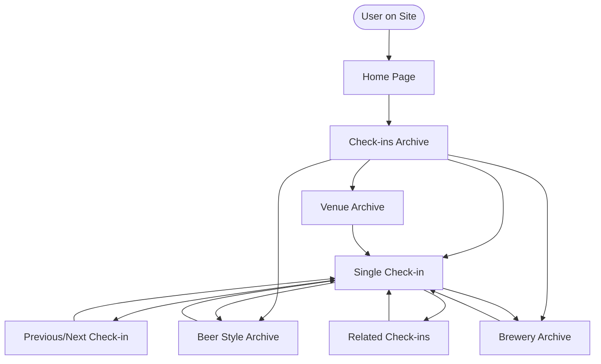

# Navigation Flow

## Overview

This document describes navigation between different views: archive, single, and taxonomy pages.

## Navigation Structure



## Archive Navigation

### Main Archive

**URL**: `/checkins/`

**Content**:
- All check-ins
- Grid/table view
- Filters
- Search

**Navigation From**:
- Home page
- Menu item
- Breadcrumb

**Navigation To**:
- Single check-in (click card/row)
- Taxonomy archives (click style/brewery/venue)
- Filtered results

---

### Beer Style Archive

**URL**: `/beer-style/{style-slug}/`

**Content**:
- Check-ins filtered by beer style
- Style name and description
- Same grid/table view as main archive

**Navigation From**:
- Main archive (click style link)
- Single check-in (click style link)
- Taxonomy widget

**Navigation To**:
- Single check-in
- Parent/child styles (if hierarchical)

---

### Brewery Archive

**URL**: `/brewery/{brewery-slug}/`

**Content**:
- Check-ins filtered by brewery
- Brewery name
- Same grid/table view

**Navigation From**:
- Main archive (click brewery link)
- Single check-in (click brewery link)

**Navigation To**:
- Single check-in
- Related breweries (optional)

---

### Venue Archive

**URL**: `/venue/{venue-slug}/`

**Content**:
- Check-ins filtered by venue
- Venue name
- Same grid/table view

**Navigation From**:
- Main archive (click venue link)
- Single check-in (click venue link)

**Navigation To**:
- Single check-in

---

## Single Check-in Navigation

### Previous/Next Navigation

**Location**: Bottom of single check-in page

**Functionality**:
- Previous check-in (chronologically earlier)
- Next check-in (chronologically later)
- Shows beer name and rating in link

**Implementation**:
```php
the_post_navigation([
    'prev_text' => '← Previous: %title',
    'next_text' => 'Next: %title →',
]);
```

**Keyboard Shortcuts** (optional):
- Left arrow: Previous
- Right arrow: Next

---

### Related Check-ins

**Location**: After main content

**Sections**:
1. **Same Brewery**: Other beers from this brewery
2. **Same Style**: Other beers of this style
3. **Similar Rating**: Beers with similar rating

**Display**:
- Grid of check-in cards
- Links to related check-ins
- Limit: 6-12 related check-ins

---

### Taxonomy Links

**Location**: Throughout single check-in

**Links**:
- Beer style → Style archive
- Brewery → Brewery archive
- Venue → Venue archive

**Behavior**:
- Click link → Navigate to taxonomy archive
- Maintains context (breadcrumb)

---

## Breadcrumb Navigation

### Structure

```
Home > Check-ins > [Beer Style] > [Beer Name]
Home > Check-ins > [Brewery] > [Beer Name]
Home > Check-ins > [Beer Name]
```

### Implementation

```php
function bj_breadcrumb() {
    $breadcrumb = [];
    $breadcrumb[] = '<a href="' . home_url() . '">Home</a>';
    $breadcrumb[] = '<a href="' . get_post_type_archive_link('beer') . '">Check-ins</a>';
    
    if (is_tax('beer_style')) {
        $term = get_queried_object();
        $breadcrumb[] = '<a href="' . get_term_link($term) . '">' . $term->name . '</a>';
    }
    
    if (is_singular('beer')) {
        $breadcrumb[] = get_the_title();
    }
    
    echo implode(' > ', $breadcrumb);
}
```

---

## Menu Integration

### WordPress Menu

**Menu Items**:
- Check-ins Archive
- Beer Styles (dropdown)
- Breweries (dropdown)
- Venues (dropdown)

**Auto-population** (optional):
- Automatically add popular styles/breweries to menu
- Update when new terms created

---

## URL Structure

### Permalink Structure

**Archive**: `/checkins/`
**Single**: `/checkins/{beer-name-brewery-name}/`
**Style**: `/beer-style/{style-slug}/`
**Brewery**: `/brewery/{brewery-slug}/`
**Venue**: `/venue/{venue-slug}/`

### Custom Permalinks

Users can customize permalink structure via WordPress settings:
- Post name: `/checkins/{post-slug}/`
- Date and name: `/checkins/2025/11/{post-slug}/`
- Custom structure

---

## Filter Navigation

### Filter State

**URL Parameters**:
- `?style=ipa` - Filter by style
- `?brewery=brasserie-meteor` - Filter by brewery
- `?rating=4` - Filter by rating
- `?date_from=2025-01-01` - Filter by date

**State Persistence**:
- Filters maintained in URL
- Shareable filtered URLs
- Browser back/forward support

---

## Search Navigation

### Search Results

**URL**: `/checkins/?s={search-term}`

**Behavior**:
- Full-text search across beer name, brewery, comment
- Results displayed in archive format
- Highlight matching terms

---

## Related Documentation

- [Display Flow](display.md)
- [Templates](../frontend/templates.md)
- [Template Hierarchy](../frontend/template-hierarchy.md)

