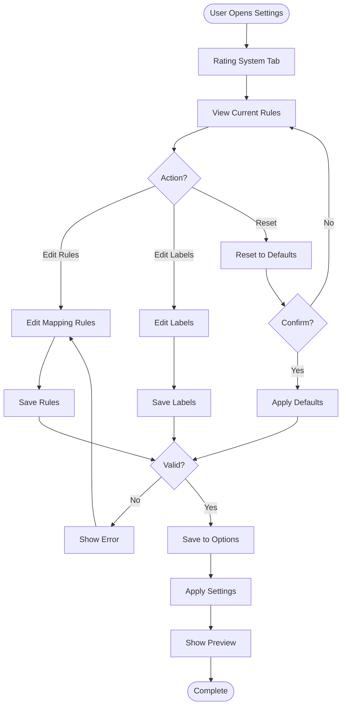

# Rating Configuration Flow

## Overview

This document describes how users configure the rating system: mapping rules and custom labels.

## Configuration Flow



## Accessing Settings

### Navigation

**Path**: `Jardin Toasts > Settings > Rating System`

**Access**:
1. Go to WordPress admin
2. Click "Jardin Toasts" in menu
3. Click "Settings"
4. Click "Rating System" tab

---

## Rating Mapping Rules

### Default Rules

**Display**:
```
0.0 - 0.9  →  ⭐ (0 stars)
1.0 - 1.9  →  ⭐ (1 star)
2.0 - 2.9  →  ⭐⭐ (2 stars)
3.0 - 3.4  →  ⭐⭐⭐ (3 stars)
3.5 - 4.4  →  ⭐⭐⭐⭐ (4 stars)
4.5 - 5.0  →  ⭐⭐⭐⭐⭐ (5 stars)
```

### Editing Rules

**Interface**:
- Table with columns: Min, Max, Stars
- Editable fields for each range
- Add/Remove range buttons
- Validation: Ranges must not overlap

**Validation**:
- Min must be < Max
- Ranges must cover 0.0 to 5.0
- No gaps between ranges
- No overlaps

**Example Custom Rules**:
```
0.0 - 1.4  →  ⭐ (1 star) - More lenient
1.5 - 2.4  →  ⭐⭐ (2 stars)
2.5 - 3.4  →  ⭐⭐⭐ (3 stars)
3.5 - 4.4  →  ⭐⭐⭐⭐ (4 stars)
4.5 - 5.0  →  ⭐⭐⭐⭐⭐ (5 stars)
```

---

## Rating Labels

### Default Labels

**Display**:
- 0 stars: "Undrinkable - Not even beer"
- 1 star: "Terrible - Only if there's no alternative"
- 2 stars: "Mediocre - Meh, it's okay I guess"
- 3 stars: "Decent - A solid thirst quencher"
- 4 stars: "Great - Now we're talking! A real pleasure"
- 5 stars: "Exceptional - Buy it with your eyes closed. Masterpiece!"

### Editing Labels

**Interface**:
- Text input for each rating level (0-5)
- Character limit: 500 characters
- Preview of label display
- Reset to defaults button

**Customization Example**:
```
0 stars: "Dégueulasse, à fuir comme la peste"
1 star: "Soit je ne pouvais pas refuser, soit j'étais ivre"
2 stars: "Ça passe quand y'a pas d'alternative"
3 stars: "Ok là ça commence à être okay"
4 stars: "Ah bah voilà, ça c'est de la bière !"
5 stars: "Tu veux te faire plaisir ? Achète les yeux fermés !"
```

---

## Display Options

### Settings

**Options**:
- ☑ Display labels on single check-in pages
- ☐ Display labels in archive (grid cards)
- ☐ Display labels in list view
- ☑ Show original rating in tooltip (hover)

**Purpose**: Control where labels are displayed

---

## Saving Configuration

### Validation

**Before Save**:
1. Validate mapping rules:
   - Ranges valid
   - No gaps or overlaps
   - Covers 0.0-5.0
2. Validate labels:
   - Not empty (optional)
   - Character limit respected
3. Validate display options:
   - At least one display location selected

---

### Apply Changes

**Actions**:
1. Save to `wp_options`:
   - `jb_rating_rules`
   - `jb_rating_labels`
   - `jb_rating_display_*` options
2. Clear cache:
   - Clear rating-related transients
   - Clear post meta cache
3. Show success message

---

## Preview

### Live Preview

**Display**:
- Sample ratings (0-5) with current settings
- Shows stars and labels
- Updates as user edits

**Example**:
```
Rating: 4.25
Stars: ⭐⭐⭐⭐
Label: Great - Now we're talking! A real pleasure
Tooltip: Original rating: 4.25
```

---

## Reset to Defaults

### Confirmation

**Action**: Click "Reset to Defaults"

**Confirmation Dialog**:
- "Are you sure you want to reset to default settings?"
- "This will overwrite your custom rules and labels."

**If Confirmed**:
1. Restore default rules
2. Restore default labels
3. Reset display options
4. Save and apply

---

## Impact of Changes

### Existing Check-ins

**Rating Mapping**:
- Existing `_jb_rating_rounded` values are NOT updated
- Only new imports use new mapping rules
- Option to recalculate existing ratings (future feature)

**Labels**:
- Labels are displayed dynamically
- Changes apply immediately to all check-ins
- No data migration needed

---

## Best Practices

### Mapping Rules

- Keep ranges logical and intuitive
- Ensure full coverage (0.0-5.0)
- Test with sample ratings
- Consider user expectations

### Labels

- Keep labels concise but descriptive
- Match tone to your audience
- Consider language/localization
- Test readability

---

## Related Documentation

- [Rating System Architecture](../architecture/rating-system.md)
- [Template Tags](../frontend/template-tags.md)
- [Settings Documentation](../wordpress/hooks.md)

