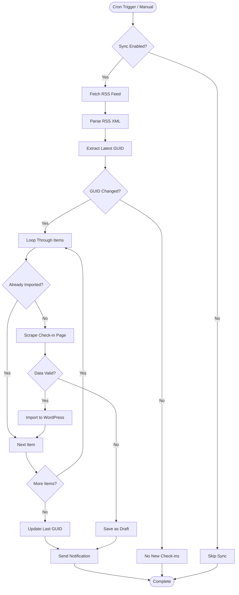

# RSS Synchronization Flow

## Overview

This document describes the automatic RSS synchronization process, from trigger to completion.

## Synchronization Flow



## Detailed Steps

### Step 1: Sync Trigger

**Automatic**:
- WordPress cron event: `bj_rss_sync`
- Frequency: Adaptive (6h/daily/weekly based on activity)
- Scheduled based on last check-in date

**Manual**:
- User clicks "Sync Now" button in admin
- Immediate execution

---

### Step 2: Check Sync Enabled

**Validation**:
- Check `bj_sync_enabled` option
- If disabled, skip sync

---

### Step 3: Fetch RSS Feed

**Actions**:
1. Get RSS feed URL from settings
2. Fetch feed using WordPress HTTP API
3. Timeout: 10 seconds
4. Retry: Up to 3 times on failure

**Error Handling**:
- Network errors: Retry with exponential backoff
- Invalid URL: Log error, notify admin
- Feed unavailable: Log error, skip sync

---

### Step 4: Parse RSS XML

**Actions**:
1. Parse XML using WordPress SimplePie
2. Extract items (up to 25 most recent)
3. Extract basic data:
   - Title
   - Link (check-in URL)
   - GUID (unique identifier)
   - PubDate (check-in date)
   - Description (may contain image URL)

---

### Step 5: GUID Comparison (Optimization)

**Purpose**: Skip scraping if no new check-ins

**Actions**:
1. Extract GUID from first item (latest)
2. Compare with `bj_last_imported_guid` option
3. If same: Skip to completion (no new check-ins)
4. If different: Continue to import process

**Benefits**:
- Saves bandwidth
- Saves server resources
- Faster sync when no updates

---

### Step 6: Process Each Item

**Loop**: For each RSS item

**Actions**:
1. Extract check-in ID from GUID
2. Check if already imported (query by `_bj_checkin_id`)
3. If exists: Skip to next item
4. If new: Continue to scraping

---

### Step 7: Scrape Check-in Page

**Purpose**: Get complete metadata (rating, ABV, style, etc.)

**Actions**:
1. Fetch HTML page from check-in URL
2. Parse HTML using Symfony DomCrawler
3. Extract complete data:
   - Rating (REQUIRED)
   - ABV, IBU
   - Beer style
   - Full comment
   - Serving type
   - Toast count
   - Venue details

**Rate Limiting**: 2-3 seconds delay between requests

**Error Handling**:
- Network errors: Retry up to 3 times
- Parsing errors: Log warning, save as draft
- Timeout: Log error, save as draft

---

### Step 8: Validate Data

**Required Fields**:
- Beer name ✓
- Brewery name ✓
- Check-in date ✓
- Rating (0-5) ✓ **CRITICAL**

**Decision**:
- If all required present: Continue to import
- If rating missing: Save as draft
- If other required missing: Save as draft

---

### Step 9: Import to WordPress

**Actions**:
1. Create WordPress post (Custom Post Type)
2. Download and import image (if present)
3. Assign taxonomies (beer style, brewery, venue)
4. Set meta fields (all `_bj_*` fields)
5. Map rating (raw → rounded)
6. Set post status (publish or draft)

**See**: [Import Process Documentation](../architecture/import-process.md)

---

### Step 10: Update Last GUID

**Actions**:
1. Update `bj_last_imported_guid` option
2. Update `bj_last_checkin_date` option
3. Clear cache

---

### Step 11: Send Notification

**Actions**:
1. Count imported check-ins
2. Count errors/drafts
3. Send email notification (if enabled):
   - Success: "X check-ins imported successfully"
   - Errors: "X check-ins imported, Y failed"
4. Display admin notice (if errors)

---

## Adaptive Polling Logic

### Activity Detection

```php
$days_since_last = (time() - strtotime($last_checkin_date)) / DAY_IN_SECONDS;

if ($days_since_last < 7) {
    // Active user → check every 6 hours
    $schedule = 'sixhourly';
} elseif ($days_since_last < 30) {
    // Moderate activity → check daily
    $schedule = 'daily';
} else {
    // Inactive user → check weekly
    $schedule = 'weekly';
}
```

### Schedule Update

After each sync, polling frequency is recalculated based on activity.

## Error Scenarios

### RSS Feed Unavailable

**Error**: "Unable to fetch RSS feed"

**Actions**:
- Log error
- Retry on next schedule
- Notify admin if persistent

---

### Scraping Failures

**Error**: "Failed to scrape check-in page"

**Actions**:
- Save check-in as draft
- Log error with reason
- Schedule retry (3 attempts over 24 hours)
- Notify admin

---

### Validation Failures

**Error**: "Missing required data"

**Actions**:
- Save as draft with reason
- Store in `_bj_incomplete_reason` meta field
- Add to retry queue
- Notify admin

## Success Metrics

- Number of check-ins imported
- Number of images imported
- Number of taxonomies created
- Sync duration
- Last sync timestamp

## Related Documentation

- [RSS Sync Architecture](../architecture/rss-sync.md)
- [Import Process](../architecture/import-process.md)
- [Error Handling Flow](error-handling.md)

